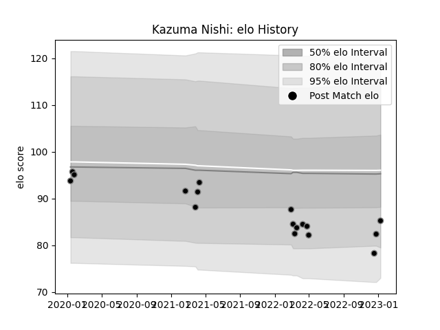

---  
layout: page  
title: Kazuma Nishi  
date: 2023-03-21 18:01:21.868740  
categories: player  
---
# Kazuma Nishi

Last updated: 2023-03-21
## Positions: P

## Current elo: 86.0

## Current Percentile: 51.0

# Elo History

# Match History

| Team             |   Appearances |   Win Rate |
|:-----------------|--------------:|-----------:|
| Black Rams Tokyo |            25 |       0.36 |

| Opponent                  |   Matches |   Win Rate |
|:--------------------------|----------:|-----------:|
| Shizuoka Blue Revs        |         4 |       0.25 |
| Saitama Wild Knights      |         3 |       0    |
| Yokohama Canon Eagles     |         3 |       0    |
| Green Rockets Tokatsu     |         2 |       1    |
| Kobelco Kobe Steelers     |         2 |       0.5  |
| Tokyo Sungoliath          |         2 |       0    |
| Toshiba Brave Lupus Tokyo |         2 |       0.5  |
| Toyota Verblitz           |         2 |       0.5  |
| Hanazono Kintetsu Liners  |         1 |       1    |
| Hino Red Dolphins         |         1 |       1    |
| Mie Honda Heat            |         1 |       0    |
| Mitsubishi Dynaboars      |         1 |       0    |
| Munakata Sanix Blues      |         1 |       1    |