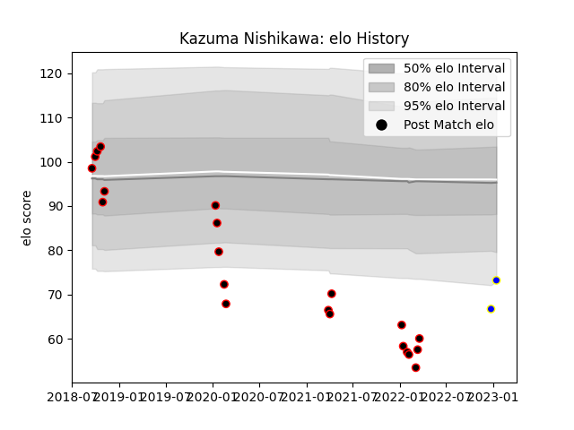

---  
layout: page  
title: Kazuma Nishikawa  
date: 2023-01-17 11:38:54.233441  
categories: player  
---
# Kazuma Nishikawa

## Positions: P

## Current elo: 73.0

## Current Percentile: 2.0

# Elo History

# Match History

| Team                            |   Appearances |   Win Rate |
|:--------------------------------|--------------:|-----------:|
| NTT Docomo Red Hurricanes Osaka |            21 |   0.380952 |
| Urayasu D-Rocks                 |             2 |   1        |

| Opponent                         |   Matches |   Win Rate |
|:---------------------------------|----------:|-----------:|
| Shizuoka Blue Revs               |         3 |          0 |
| Mitsubishi Dynaboars             |         2 |          1 |
| Toshiba Brave Lupus Tokyo        |         2 |          0 |
| Saitama Wild Knights             |         2 |          0 |
| Chugoku Red Regulions            |         1 |          1 |
| Toyota Industries Shuttles Aichi |         1 |          1 |
| Tokyo Sungoliath                 |         1 |          0 |
| Shimizu Blue Sharks              |         1 |          1 |
| Munakata Sanix Blues             |         1 |          0 |
| Black Rams Tokyo                 |         1 |          0 |
| Mazda Blue Zoomers               |         1 |          1 |
| Kyuden Voltex                    |         1 |          1 |
| Kobelco Kobe Steelers            |         1 |          0 |
| Kamaishi Seawaves                |         1 |          1 |
| Hino Red Dolphins                |         1 |          1 |
| Hanazono Kintetsu Liners         |         1 |          0 |
| Green Rockets Tokatsu            |         1 |          1 |
| Yokohama Canon Eagles            |         1 |          0 |