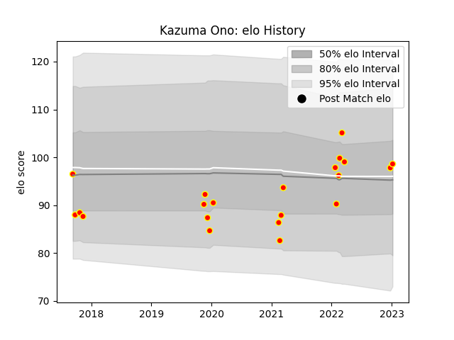

---  
layout: page  
title: Kazuma Ono  
date: 2023-01-13 11:30:20.126671  
categories: player  
---
# Kazuma Ono

## Positions: P

## Current elo: 99.0

## Current Percentile: 61.0

# Elo History

# Match History

| Team          |   Appearances |   Win Rate |
|:--------------|--------------:|-----------:|
| Kyuden Voltex |            21 |    0.47619 |

| Opponent                         |   Matches |   Win Rate |
|:---------------------------------|----------:|-----------:|
| Chugoku Red Regulions            |         3 |   1        |
| Shimizu Blue Sharks              |         3 |   0.666667 |
| Toyota Industries Shuttles Aichi |         3 |   0        |
| Coca-Cola Red Sparks             |         2 |   0        |
| Kamaishi Seawaves                |         2 |   1        |
| Kurita Water Gush                |         2 |   0.5      |
| Munakata Sanix Blues             |         2 |   0        |
| Chubu Electric Power             |         1 |   1        |
| Mie Honda Heat                   |         1 |   0        |
| Mitsubishi Dynaboars             |         1 |   0        |
| Skyactivs Hiroshima              |         1 |   1        |