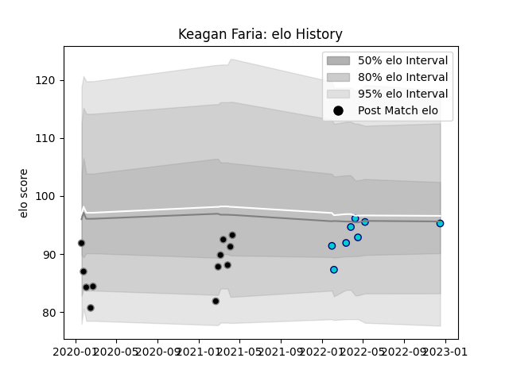

---  
layout: page  
title: Keagan Faria  
date: 2023-01-13 11:27:26.317874  
categories: player  
---
# Keagan Faria

## Positions: W

## Current elo: 106.0

## Current Percentile: 81.0

# Elo History

# Match History

| Team               |   Appearances |   Win Rate |
|:-------------------|--------------:|-----------:|
| Black Rams Tokyo   |            13 |   0.384615 |
| Shizuoka Blue Revs |            10 |   0.3      |

| Opponent                        |   Matches |   Win Rate |
|:--------------------------------|----------:|-----------:|
| Saitama Wild Knights            |         3 |        0   |
| Toshiba Brave Lupus Tokyo       |         3 |        0   |
| Green Rockets Tokatsu           |         2 |        1   |
| Kobelco Kobe Steelers           |         2 |        0   |
| NTT Docomo Red Hurricanes Osaka |         2 |        0.5 |
| Shizuoka Blue Revs              |         2 |        0.5 |
| Urayasu D-Rocks                 |         2 |        0.5 |
| Black Rams Tokyo                |         1 |        1   |
| Hino Red Dolphins               |         1 |        1   |
| Mie Honda Heat                  |         1 |        0   |
| Munakata Sanix Blues            |         1 |        1   |
| Tokyo Sungoliath                |         1 |        0   |
| Toyota Verblitz                 |         1 |        0   |
| Yokohama Canon Eagles           |         1 |        0   |