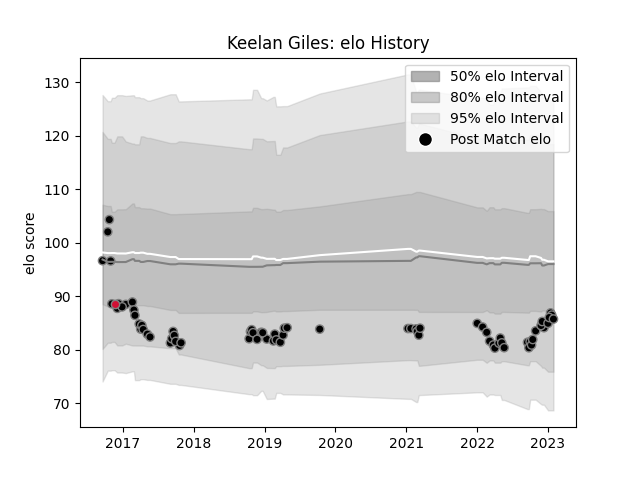

---  
layout: page  
title: Keelan Giles  
date: 2023-01-06 00:12:07.297991  
categories: player  
---
# Keelan Giles

## Positions: W

## Current elo: 86.0

## Current Percentile: 4.0

# Elo History

# Match History

| Team    |   Appearances |   Win Rate |
|:--------|--------------:|-----------:|
| Ospreys |            67 |   0.462687 |
| Wales   |             1 |   1        |

| Opponent             |   Matches |   Win Rate |
|:---------------------|----------:|-----------:|
| Scarlets             |         6 |   0.583333 |
| Dragons              |         6 |   0.833333 |
| Munster              |         5 |   0        |
| Glasgow Warriors     |         5 |   0.4      |
| Benetton Treviso     |         4 |   0.5      |
| Cardiff Blues        |         4 |   0.75     |
| Connacht             |         4 |   0.5      |
| Leinster             |         3 |   0        |
| Ulster               |         3 |   0        |
| Zebre                |         3 |   1        |
| Edinburgh            |         3 |   1        |
| Bulls                |         2 |   0        |
| Lyon                 |         2 |   1        |
| Stade Francais Paris |         2 |   0        |
| Stormers             |         2 |   0.25     |
| Cheetahs             |         2 |   0.5      |
| Worcester Warriors   |         2 |   0        |
| Lions                |         2 |   0        |
| Japan                |         1 |   1        |
| Leicester Tigers     |         1 |   0        |
| Grenoble             |         1 |   1        |
| Newcastle Falcons    |         1 |   1        |
| Pau                  |         1 |   1        |
| Clermont Auvergne    |         1 |   0        |
| Sharks               |         1 |   0        |
| Southern Kings       |         1 |   1        |