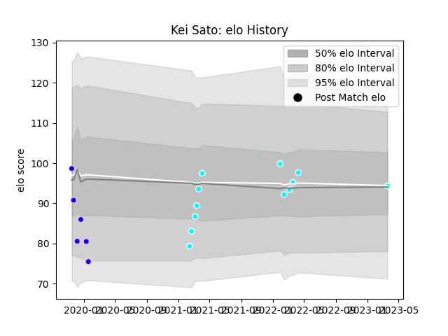

---  
layout: page  
title: Kei Sato  
date: 2023-03-21 18:19:06.786005  
categories: player  
---
# Kei Sato

Last updated: 2023-03-21
## Positions: H, FL

## Current elo: 94.0

## Current Percentile: None

# Elo History

# Match History

| Team                             |   Appearances |   Win Rate |
|:---------------------------------|--------------:|-----------:|
| Toyota Industries Shuttles Aichi |            12 |   0.916667 |
| Kurita Water Gush                |             6 |   0.333333 |

| Opponent                         |   Matches |   Win Rate |
|:---------------------------------|----------:|-----------:|
| Chugoku Red Regulions            |         3 |        1   |
| Kyuden Voltex                    |         3 |        1   |
| Coca-Cola Red Sparks             |         2 |        0.5 |
| Hanazono Kintetsu Liners         |         2 |        0.5 |
| Shimizu Blue Sharks              |         2 |        1   |
| Kamaishi Seawaves                |         1 |        0   |
| Kurita Water Gush                |         1 |        1   |
| Mazda Blue Zoomers               |         1 |        1   |
| Mie Honda Heat                   |         1 |        0   |
| Skyactivs Hiroshima              |         1 |        1   |
| Toyota Industries Shuttles Aichi |         1 |        0   |