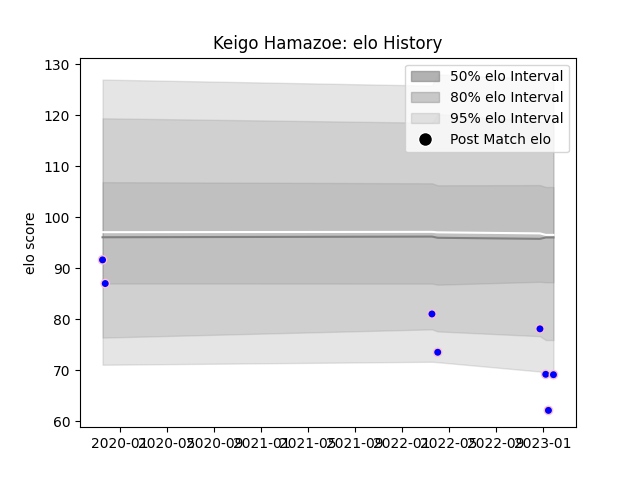

---  
layout: page  
title: Keigo Hamazoe  
date: 2023-02-02 19:01:13.849930  
categories: player  
---
# Keigo Hamazoe

## Positions: W

## Current elo: 69.0

## Current Percentile: 2.0

# Elo History

# Match History

| Team              |   Appearances |   Win Rate |
|:------------------|--------------:|-----------:|
| Kurita Water Gush |             8 |      0.375 |

| Opponent                         |   Matches |   Win Rate |
|:---------------------------------|----------:|-----------:|
| Chugoku Red Regulions            |         2 |        0   |
| Kyuden Voltex                    |         2 |        0.5 |
| Coca-Cola Red Sparks             |         1 |        0   |
| NTT Docomo Red Hurricanes Osaka  |         1 |        1   |
| Skyactivs Hiroshima              |         1 |        1   |
| Toyota Industries Shuttles Aichi |         1 |        0   |