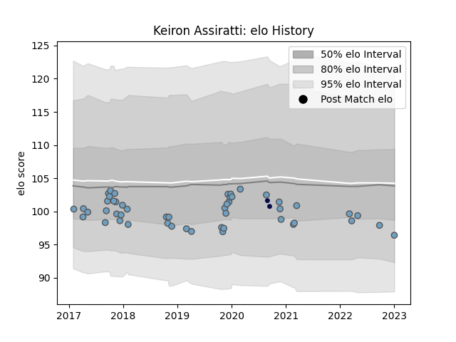

---  
layout: page  
title: Keiron Assiratti  
date: 2023-01-06 00:17:50.916857  
categories: player  
---
# Keiron Assiratti

## Positions: P

## Current elo: 96.0

## Current Percentile: None

# Elo History

# Match History

| Team          |   Appearances |   Win Rate |
|:--------------|--------------:|-----------:|
| Cardiff Blues |            49 |   0.357143 |
| Bristol Rugby |             2 |   0        |

| Opponent          |   Matches |   Win Rate |
|:------------------|----------:|-----------:|
| Munster           |         5 |   0        |
| Dragons           |         4 |   1        |
| Sale Sharks       |         4 |   0.25     |
| Glasgow Warriors  |         4 |   0        |
| Benetton Treviso  |         3 |   1        |
| Ulster            |         3 |   0.166667 |
| Scarlets          |         3 |   0        |
| Ospreys           |         3 |   0.333333 |
| Pau               |         2 |   0.5      |
| Zebre             |         2 |   1        |
| Leinster          |         2 |   0        |
| Leicester Tigers  |         2 |   0        |
| Edinburgh         |         2 |   0        |
| Connacht          |         2 |   0.5      |
| Cheetahs          |         2 |   0.5      |
| London Irish      |         1 |   0        |
| Calvisano         |         1 |   1        |
| Newcastle Falcons |         1 |   0        |
| Gloucester Rugby  |         1 |   0        |
| Southern Kings    |         1 |   1        |
| Stormers          |         1 |   0        |
| Wasps             |         1 |   0        |
| Lyon              |         1 |   1        |