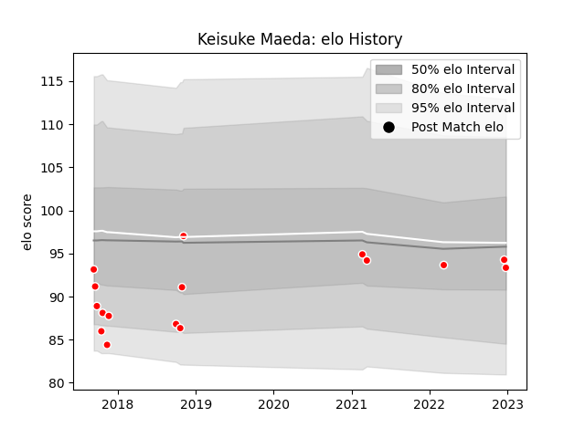

---  
layout: page  
title: Keisuke Maeda  
date: 2022-12-28 12:52:29.060381  
categories: player  
---
# Keisuke Maeda

## Positions: P

## Current elo: 93.0

## Current Percentile: None

# Elo History

# Match History

| Team                  |   Appearances |   Win Rate |
|:----------------------|--------------:|-----------:|
| Chugoku Red Regulions |            16 |     0.1875 |

| Opponent                         |   Matches |   Win Rate |
|:---------------------------------|----------:|-----------:|
| Kamaishi Seawaves                |         2 |        0   |
| Kyuden Voltex                    |         2 |        0   |
| Mazda Blue Zoomers               |         2 |        0.5 |
| Mitsubishi Dynaboars             |         2 |        0   |
| NTT Docomo Red Hurricanes Osaka  |         2 |        0   |
| Toyota Industries Shuttles Aichi |         2 |        0   |
| Chubu Electric Power             |         1 |        1   |
| Hino Red Dolphins                |         1 |        0   |
| Mie Honda Heat                   |         1 |        0   |
| Skyactivs Hiroshima              |         1 |        1   |