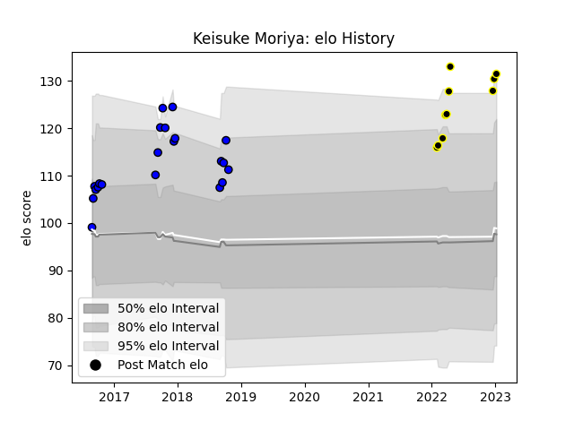

---  
layout: page  
title: Keisuke Moriya  
date: 2022-12-28 12:57:44.695441  
categories: player  
---
# Keisuke Moriya

## Positions: FB, C

## Current elo: 125.0

## Current Percentile: 96.0

# Elo History

# Match History

| Team                 |   Appearances |   Win Rate |
|:---------------------|--------------:|-----------:|
| Saitama Wild Knights |            21 |   0.904762 |
| Tokyo Sungoliath     |             9 |   0.888889 |

| Opponent                          |   Matches |   Win Rate |
|:----------------------------------|----------:|-----------:|
| Yokohama Canon Eagles             |         4 |   1        |
| Green Rockets Tokatsu             |         3 |   1        |
| Shizuoka Blue Revs                |         3 |   0.666667 |
| Black Rams Tokyo                  |         2 |   1        |
| Coca-Cola Red Sparks              |         2 |   1        |
| Kobelco Kobe Steelers             |         2 |   1        |
| Kubota Spears Funabashi Tokyo-Bay |         2 |   0.5      |
| NTT Docomo Red Hurricanes Osaka   |         2 |   1        |
| Tokyo Sungoliath                  |         2 |   0.5      |
| Urayasu D-Rocks                   |         2 |   1        |
| Hanazono Kintetsu Liners          |         1 |   1        |
| Mie Honda Heat                    |         1 |   1        |
| Munakata Sanix Blues              |         1 |   1        |
| Toshiba Brave Lupus Tokyo         |         1 |   1        |
| Toyota Industries Shuttles Aichi  |         1 |   1        |
| Toyota Verblitz                   |         1 |   1        |