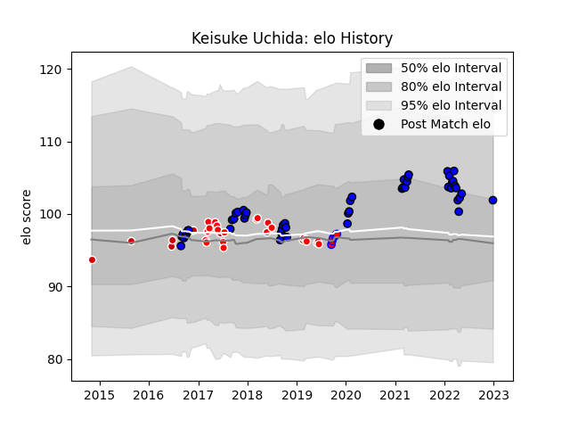

---  
layout: page  
title: Keisuke Uchida  
date: 2022-12-28 12:57:30.424493  
categories: player  
---
# Keisuke Uchida

## Positions: SH

## Country: Japan

## Current elo: 102.0

## Current Percentile: 76.0

# Elo History

# Match History

| Team                 |   Appearances |   Win Rate |
|:---------------------|--------------:|-----------:|
| Saitama Wild Knights |            50 |  0.93      |
| Sunwolves            |            23 |  0.0869565 |
| Japan                |             8 |  0.375     |
| Tasman               |             6 |  1         |

| Opponent                          |   Matches |   Win Rate |
|:----------------------------------|----------:|-----------:|
| Yokohama Canon Eagles             |         7 |   1        |
| Shizuoka Blue Revs                |         6 |   0.833333 |
| Black Rams Tokyo                  |         4 |   0.75     |
| Kobelco Kobe Steelers             |         4 |   0.875    |
| Kubota Spears Funabashi Tokyo-Bay |         3 |   1        |
| Urayasu D-Rocks                   |         3 |   1        |
| Toyota Verblitz                   |         3 |   1        |
| Toshiba Brave Lupus Tokyo         |         3 |   1        |
| Tokyo Sungoliath                  |         3 |   0.666667 |
| Coca-Cola Red Sparks              |         3 |   1        |
| Stormers                          |         3 |   0        |
| Green Rockets Tokatsu             |         3 |   1        |
| Sharks                            |         3 |   0        |
| Scotland                          |         2 |   0        |
| NTT Docomo Red Hurricanes Osaka   |         2 |   1        |
| Lions                             |         2 |   0        |
| Auckland                          |         2 |   1        |
| Jaguares                          |         2 |   0        |
| Blues                             |         2 |   0.5      |
| Brumbies                          |         2 |   0        |
| Bulls                             |         2 |   0.5      |
| Cheetahs                          |         2 |   0        |
| Melbourne Rebels                  |         1 |   0        |
| Wellington                        |         1 |   1        |
| Wales                             |         1 |   0        |
| Waikato                           |         1 |   1        |
| Uruguay                           |         1 |   1        |
| Toyota Industries Shuttles Aichi  |         1 |   1        |
| Fiji                              |         1 |   0        |
| Southern Kings                    |         1 |   0        |
| Georgia                           |         1 |   1        |
| Hanazono Kintetsu Liners          |         1 |   1        |
| Hawke's Bay                       |         1 |   1        |
| Romania                           |         1 |   1        |
| Queensland Reds                   |         1 |   0        |
| North Harbour                     |         1 |   1        |
| New Zealand Maori                 |         1 |   0        |
| New South Wales Waratahs          |         1 |   0        |
| Hino Red Dolphins                 |         1 |   1        |
| Hurricanes                        |         1 |   0        |
| Mitsubishi Dynaboars              |         1 |   1        |
| Mie Honda Heat                    |         1 |   1        |
| Munakata Sanix Blues              |         1 |   1        |