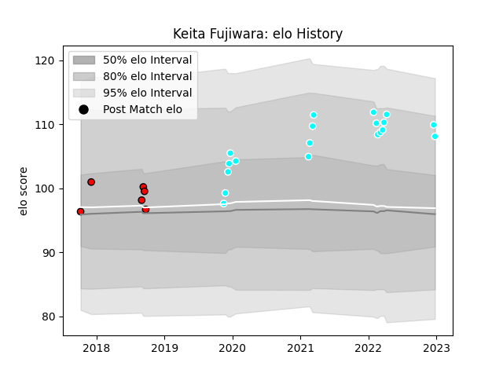

---  
layout: page  
title: Keita Fujiwara  
date: 2022-12-28 12:52:48.485269  
categories: player  
---
# Keita Fujiwara

## Positions: SH

## Current elo: 108.0

## Current Percentile: 87.0

# Elo History

# Match History

| Team                             |   Appearances |   Win Rate |
|:---------------------------------|--------------:|-----------:|
| Toyota Industries Shuttles Aichi |            19 |   0.894737 |
| Toshiba Brave Lupus Tokyo        |             6 |   0.666667 |

| Opponent                 |   Matches |   Win Rate |
|:-------------------------|----------:|-----------:|
| Coca-Cola Red Sparks     |         4 |       0.75 |
| Kyuden Voltex            |         4 |       1    |
| Chugoku Red Regulions    |         3 |       1    |
| Shimizu Blue Sharks      |         3 |       1    |
| Kurita Water Gush        |         2 |       1    |
| Black Rams Tokyo         |         1 |       1    |
| Hanazono Kintetsu Liners |         1 |       0    |
| Hino Red Dolphins        |         1 |       1    |
| Kamaishi Seawaves        |         1 |       1    |
| Mazda Blue Zoomers       |         1 |       1    |
| Saitama Wild Knights     |         1 |       0    |
| Shizuoka Blue Revs       |         1 |       1    |
| Skyactivs Hiroshima      |         1 |       1    |
| Yokohama Canon Eagles    |         1 |       0    |