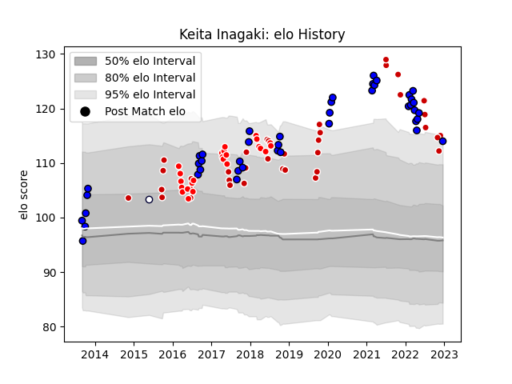

---  
layout: page  
title: Keita Inagaki  
date: 2023-03-21 17:57:59.701935  
categories: player  
---
# Keita Inagaki

Last updated: 2023-03-21
## Positions: P

## Country: Japan

## Current elo: 122.0

## Current Percentile: 96.0

# Elo History

# Match History

| Team                 |   Appearances |   Win Rate |
|:---------------------|--------------:|-----------:|
| Saitama Wild Knights |            84 |  0.886905  |
| Japan                |            40 |  0.3875    |
| Sunwolves            |            24 |  0.0416667 |
| Melbourne Rebels     |             1 |  0         |

| Opponent                          |   Matches |   Win Rate |
|:----------------------------------|----------:|-----------:|
| Toshiba Brave Lupus Tokyo         |         9 |   0.833333 |
| Yokohama Canon Eagles             |         8 |   0.875    |
| Urayasu D-Rocks                   |         7 |   0.857143 |
| Tokyo Sungoliath                  |         7 |   0.714286 |
| Kubota Spears Funabashi Tokyo-Bay |         7 |   1        |
| Shizuoka Blue Revs                |         7 |   0.785714 |
| Toyota Verblitz                   |         6 |   0.833333 |
| Black Rams Tokyo                  |         6 |   0.833333 |
| Kobelco Kobe Steelers             |         6 |   0.916667 |
| Scotland                          |         5 |   0.2      |
| Ireland                           |         5 |   0.2      |
| Hanazono Kintetsu Liners          |         4 |   1        |
| Green Rockets Tokatsu             |         4 |   1        |
| France                            |         4 |   0.125    |
| NTT Docomo Red Hurricanes Osaka   |         3 |   1        |
| Coca-Cola Red Sparks              |         3 |   1        |
| South Africa                      |         3 |   0.333333 |
| Melbourne Rebels                  |         3 |   0        |
| Bulls                             |         3 |   0.333333 |
| New South Wales Waratahs          |         3 |   0        |
| Samoa                             |         2 |   1        |
| Russia                            |         2 |   1        |
| Sharks                            |         2 |   0        |
| Romania                           |         2 |   1        |
| Queensland Reds                   |         2 |   0        |
| New Zealand Maori                 |         2 |   0        |
| New Zealand                       |         2 |   0        |
| Australia                         |         2 |   0        |
| Munakata Sanix Blues              |         2 |   1        |
| Italy                             |         2 |   0.5      |
| Brumbies                          |         2 |   0        |
| Georgia                           |         2 |   0.5      |
| England                           |         2 |   0        |
| Chiefs                            |         2 |   0        |
| Mie Honda Heat                    |         2 |   1        |
| Cheetahs                          |         2 |   0        |
| Tonga                             |         1 |   1        |
| Uruguay                           |         1 |   1        |
| British and Irish Lions           |         1 |   0        |
| United States of America          |         1 |   1        |
| Toyota Industries Shuttles Aichi  |         1 |   1        |
| Canada                            |         1 |   1        |
| Southern Kings                    |         1 |   0        |
| Stormers                          |         1 |   0        |
| Crusaders                         |         1 |   0        |
| Highlanders                       |         1 |   0        |
| Hino Red Dolphins                 |         1 |   1        |
| Jaguares                          |         1 |   0        |
| Lions                             |         1 |   0        |
| Mitsubishi Dynaboars              |         1 |   1        |