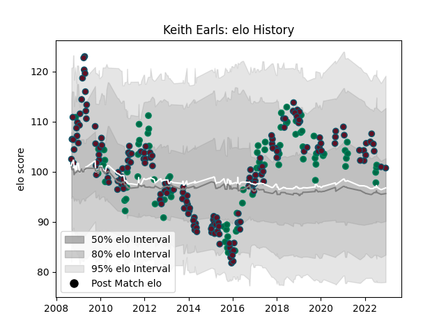

---  
layout: page  
title: Keith Earls  
date: 2022-12-18 16:24:04.349965  
categories: player  
---
# Keith Earls

## Positions: W, C

## Country: Ireland

## Current elo: 103.0

## Current Percentile: 70.0

# Elo History

# Match History

| Team    |   Appearances |   Win Rate |
|:--------|--------------:|-----------:|
| Munster |           182 |   0.637363 |
| Ireland |            85 |   0.652941 |

| Opponent                 |   Matches |   Win Rate |
|:-------------------------|----------:|-----------:|
| Leinster                 |        25 |   0.24     |
| Connacht                 |        15 |   0.733333 |
| Edinburgh                |        13 |   0.846154 |
| Ulster                   |        13 |   0.5      |
| Ospreys                  |        13 |   0.615385 |
| Wales                    |        13 |   0.5      |
| Italy                    |        11 |   0.909091 |
| Glasgow Warriors         |        11 |   0.727273 |
| England                  |        10 |   0.5      |
| Benetton Treviso         |         9 |   0.888889 |
| Scotland                 |         9 |   0.666667 |
| France                   |         9 |   0.555556 |
| Castres Olympique        |         7 |   0.785714 |
| Dragons                  |         7 |   0.857143 |
| Racing 92                |         7 |   0.5      |
| Scarlets                 |         6 |   0.75     |
| New Zealand              |         6 |   0.333333 |
| Saracens                 |         5 |   0.4      |
| Cardiff Blues            |         5 |   0.6      |
| Leicester Tigers         |         5 |   0.4      |
| Australia                |         5 |   0.8      |
| Northampton Saints       |         5 |   0.8      |
| South Africa             |         4 |   0.5      |
| Perpignan                |         4 |   1        |
| Sale Sharks              |         3 |   1        |
| Zebre                    |         3 |   1        |
| Stade Toulousain         |         3 |   0.666667 |
| Argentina                |         3 |   0.666667 |
| Japan                    |         3 |   0.666667 |
| Toulon                   |         3 |   0.333333 |
| Clermont Auvergne        |         3 |   0.333333 |
| Canada                   |         3 |   1        |
| Gloucester Rugby         |         3 |   1        |
| Stade Francais Paris     |         2 |   0.5      |
| United States of America |         2 |   1        |
| Wasps                    |         2 |   1        |
| London Irish             |         2 |   0.5      |
| Russia                   |         2 |   1        |
| New Zealand Maori        |         2 |   0.5      |
| Montauban                |         2 |   1        |
| Samoa                    |         1 |   1        |
| Romania                  |         1 |   1        |
| Stormers                 |         1 |   1        |
| Harlequins               |         1 |   0        |
| Fiji                     |         1 |   1        |
| Exeter Chiefs            |         1 |   1        |
| Brive                    |         1 |   1        |
| Biarritz Olympique       |         1 |   0        |
| Aironi                   |         1 |   1        |