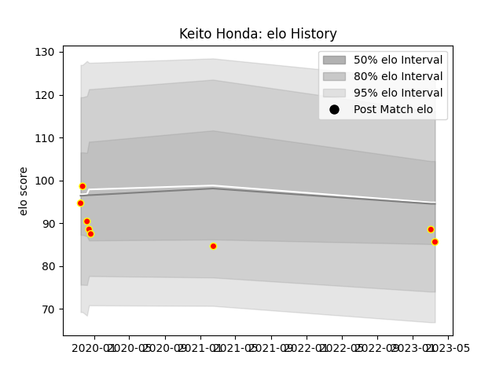

---  
layout: page  
title: Keito Honda  
date: 2023-03-09 10:07:31.241722  
categories: player  
---
# Keito Honda

## Positions: FB, W

## Current elo: 89.0

## Current Percentile: None

# Elo History

# Match History

| Team          |   Appearances |   Win Rate |
|:--------------|--------------:|-----------:|
| Kyuden Voltex |             7 |   0.428571 |

| Opponent                         |   Matches |   Win Rate |
|:---------------------------------|----------:|-----------:|
| Toyota Industries Shuttles Aichi |         2 |          0 |
| Chugoku Red Regulions            |         1 |          1 |
| Hanazono Kintetsu Liners         |         1 |          0 |
| Kamaishi Seawaves                |         1 |          1 |
| Kurita Water Gush                |         1 |          0 |
| Shimizu Blue Sharks              |         1 |          1 |