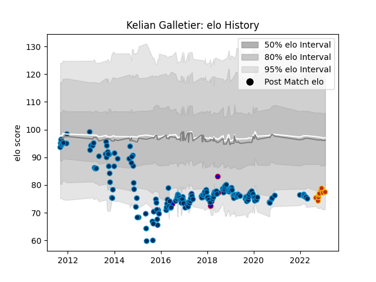

---  
layout: page  
title: Kelian Galletier  
date: 2023-02-02 18:43:16.141845  
categories: player  
---
# Kelian Galletier

## Positions: FL, N8

## Country: France

## Current elo: 77.0

## Current Percentile: 9.0

# Elo History

# Match History

| Team                |   Appearances |   Win Rate |
|:--------------------|--------------:|-----------:|
| Montpellier Herault |           181 |   0.516575 |
| Perpignan           |            10 |   0.3      |
| France              |             6 |   0.5      |

| Opponent             |   Matches |   Win Rate |
|:---------------------|----------:|-----------:|
| Stade Francais Paris |        14 |   0.535714 |
| Castres Olympique    |        14 |   0.428571 |
| Toulon               |        12 |   0.416667 |
| Stade Toulousain     |        12 |   0.416667 |
| Bordeaux Begles      |        11 |   0.636364 |
| Brive                |        11 |   0.5      |
| La Rochelle          |        11 |   0.454545 |
| Racing 92            |        10 |   0.1      |
| Pau                  |        10 |   0.6      |
| Lyon                 |        10 |   0.5      |
| Bayonne              |         9 |   0.666667 |
| Clermont Auvergne    |         9 |   0.444444 |
| Grenoble             |         8 |   0.875    |
| Glasgow Warriors     |         7 |   0.357143 |
| Perpignan            |         6 |   0.5      |
| Agen                 |         5 |   0.8      |
| Biarritz Olympique   |         5 |   0.8      |
| Oyonnax              |         3 |   1        |
| Leinster             |         3 |   0        |
| New Zealand          |         2 |   0        |
| Harlequins           |         2 |   0.5      |
| Edinburgh            |         2 |   0.5      |
| Cardiff Blues        |         2 |   1        |
| Exeter Chiefs        |         2 |   0        |
| Newcastle Falcons    |         2 |   0.5      |
| Connacht             |         2 |   0.5      |
| Bath Rugby           |         1 |   0        |
| Benetton Treviso     |         1 |   1        |
| Sale Sharks          |         1 |   1        |
| Calvisano            |         1 |   1        |
| Fiji                 |         1 |   0        |
| Northampton Saints   |         1 |   1        |
| Montpellier Herault  |         1 |   0        |
| Leicester Tigers     |         1 |   0        |
| England              |         1 |   1        |
| Italy                |         1 |   1        |
| Argentina            |         1 |   1        |
| Gloucester Rugby     |         1 |   0        |
| Ulster               |         1 |   0        |