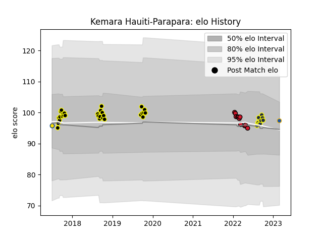

---  
layout: page  
title: Kemara Hauiti-Parapara  
date: 2023-03-17 17:42:20.453187  
categories: player  
---
# Kemara Hauiti-Parapara

## Positions: SH

## Country: Hurricanes

## Current elo: 97.0

## Current Percentile: 55.0

# Elo History

# Match History

| Team        |   Appearances |   Win Rate |
|:------------|--------------:|-----------:|
| Wellington  |            29 |   0.724138 |
| Oyonnax     |            11 |   0.545455 |
| Otago       |            10 |   0.5      |
| Highlanders |             3 |   0        |
| Hurricanes  |             1 |   0.5      |

| Opponent                |   Matches |   Win Rate |
|:------------------------|----------:|-----------:|
| Waikato                 |         4 |   0.75     |
| Tasman                  |         4 |   0.25     |
| Auckland                |         4 |   0.25     |
| Canterbury              |         4 |   0.5      |
| Manawatu                |         3 |   1        |
| Bay of Plenty           |         3 |   0.666667 |
| Northland               |         3 |   1        |
| Otago                   |         3 |   1        |
| Counties Manukau        |         2 |   0.5      |
| North Harbour           |         2 |   0.5      |
| Hawke's Bay             |         2 |   1        |
| Southland               |         2 |   1        |
| Taranaki                |         2 |   1        |
| Rouen                   |         1 |   1        |
| Narbonne                |         1 |   1        |
| Vannes                  |         1 |   1        |
| Nevers                  |         1 |   1        |
| Agen                    |         1 |   1        |
| Montauban               |         1 |   0        |
| Mont-de-Marsan          |         1 |   0        |
| Crusaders               |         1 |   0        |
| Colomiers               |         1 |   0        |
| Chiefs                  |         1 |   0        |
| Carcassonne             |         1 |   1        |
| British and Irish Lions |         1 |   0.5      |
| Blues                   |         1 |   0        |
| Bayonne                 |         1 |   0        |
| Aurillac                |         1 |   0        |
| Wellington              |         1 |   0        |