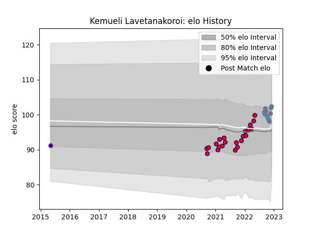

---  
layout: page  
title: Kemueli Lavetanakoroi  
date: 2023-01-15 11:41:48.241287  
categories: player  
---
# Kemueli Lavetanakoroi

## Positions: L

## Current elo: 112.0

## Current Percentile: 87.0

# Elo History

# Match History

| Team                       |   Appearances |   Win Rate |
|:---------------------------|--------------:|-----------:|
| Cognac Saint Jean d'Angély |            22 |   0.454545 |
| Bourgoin-Jallieu           |            14 |   0.607143 |
| Beziers                    |            10 |   0.2      |

| Opponent                   |   Matches |   Win Rate |
|:---------------------------|----------:|-----------:|
| Suresnes                   |         4 |   0.25     |
| Narbonne                   |         4 |   0.5      |
| Albi                       |         3 |   0.333333 |
| Dax                        |         3 |   1        |
| Blagnac                    |         3 |   0.333333 |
| Tarbes                     |         3 |   0        |
| Nice                       |         3 |   0.333333 |
| Dijon                      |         3 |   1        |
| Massy                      |         2 |   0        |
| Chambery                   |         2 |   1        |
| Carqueiranne-Hyères        |         2 |   1        |
| Bourgoin-Jallieu           |         2 |   0.5      |
| Valence Romans Drome Rugby |         2 |   0.25     |
| Cognac Saint Jean d'Angély |         1 |   1        |
| Lyon                       |         1 |   0        |
| Biarritz Olympique         |         1 |   0        |
| Montauban                  |         1 |   1        |
| Pau                        |         1 |   0        |
| Perpignan                  |         1 |   0        |
| Rennes                     |         1 |   1        |
| Soyaux-Angouleme           |         1 |   0        |
| Carcassonne                |         1 |   0        |
| US Bressane                |         1 |   0        |