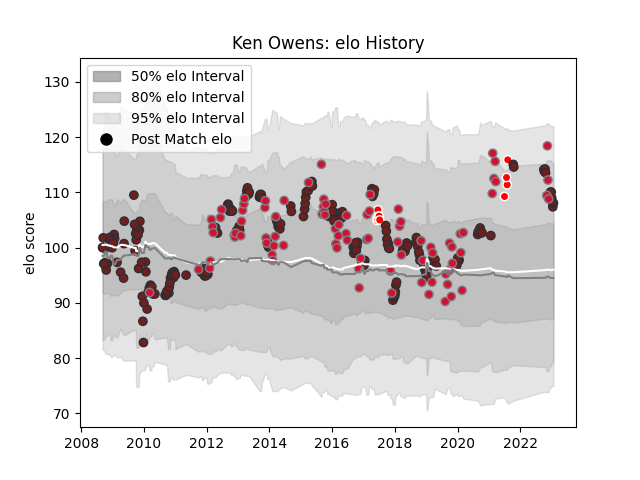

---  
layout: page  
title: Ken Owens  
date: 2023-02-02 18:43:56.227700  
categories: player  
---
# Ken Owens

## Positions: H

## Country: Wales

## Current elo: 108.0

## Current Percentile: 81.0

# Elo History

# Match History

| Team                    |   Appearances |   Win Rate |
|:------------------------|--------------:|-----------:|
| Scarlets                |           223 |   0.517937 |
| Wales                   |            88 |   0.5625   |
| British and Irish Lions |            11 |   0.5      |

| Opponent             |   Matches |   Win Rate |
|:---------------------|----------:|-----------:|
| Cardiff Blues        |        24 |   0.583333 |
| Dragons              |        23 |   0.869565 |
| Ospreys              |        18 |   0.416667 |
| Leinster             |        18 |   0.25     |
| Ulster               |        17 |   0.352941 |
| Glasgow Warriors     |        15 |   0.4      |
| Connacht             |        13 |   0.769231 |
| Benetton Treviso     |        13 |   0.692308 |
| Munster              |        13 |   0.115385 |
| England              |        12 |   0.5      |
| France               |        11 |   0.636364 |
| Ireland              |        11 |   0.5      |
| Edinburgh            |        10 |   0.3      |
| New Zealand          |        10 |   0.15     |
| South Africa         |        10 |   0.3      |
| Australia            |        10 |   0.2      |
| Italy                |        10 |   1        |
| Scotland             |         9 |   0.888889 |
| Toulon               |         6 |   0.333333 |
| London Irish         |         5 |   1        |
| Clermont Auvergne    |         4 |   0        |
| Northampton Saints   |         4 |   0.25     |
| Argentina            |         3 |   1        |
| Racing 92            |         3 |   0        |
| Saracens             |         3 |   0.5      |
| Leicester Tigers     |         3 |   0.333333 |
| Aironi               |         3 |   1        |
| Zebre                |         3 |   1        |
| Harlequins           |         3 |   0.166667 |
| Cheetahs             |         3 |   1        |
| Brive                |         3 |   0.666667 |
| Georgia              |         2 |   0.5      |
| Fiji                 |         2 |   1        |
| Exeter Chiefs        |         2 |   0        |
| Bath Rugby           |         2 |   0.5      |
| Bayonne              |         2 |   1        |
| Castres Olympique    |         2 |   1        |
| Stade Francais Paris |         2 |   0.5      |
| Blues                |         1 |   0        |
| Yorkshire Carnegie   |         1 |   1        |
| Worcester Warriors   |         1 |   1        |
| Uruguay              |         1 |   1        |
| Tonga                |         1 |   1        |
| Japan                |         1 |   1        |
| Bristol Rugby        |         1 |   1        |
| Samoa                |         1 |   0        |
| La Rochelle          |         1 |   1        |
| Perpignan            |         1 |   1        |
| Crusaders            |         1 |   1        |
| New Zealand Maori    |         1 |   1        |
| Namibia              |         1 |   1        |
| Highlanders          |         1 |   0        |
| Sale Sharks          |         1 |   1        |