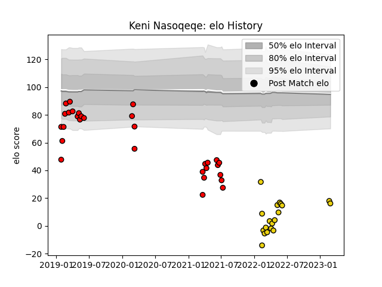

---  
layout: page  
title: Keni Nasoqeqe  
date: 2023-03-02 11:21:03.822452  
categories: player  
---
# Keni Nasoqeqe

## Positions: L, FL

## Current elo: 16.0

## Current Percentile: 0.0

# Elo History

# Match History

| Team              |   Appearances |   Win Rate |
|:------------------|--------------:|-----------:|
| San Diego Legion  |            30 |   0.583333 |
| Houston SaberCats |            19 |   0.578947 |

| Opponent               |   Matches |   Win Rate |
|:-----------------------|----------:|-----------:|
| Utah Warriors          |         6 |   0.833333 |
| Seattle Seawolves      |         5 |   0.8      |
| Austin Gilgronis       |         4 |   0.25     |
| NOLA Gold              |         4 |   1        |
| R.U. New York          |         4 |   0.25     |
| Rugby New York         |         4 |   0.25     |
| Toronto Arrows         |         4 |   0.5      |
| Dallas Jackals         |         3 |   1        |
| Houston SaberCats      |         3 |   0.666667 |
| L. A. Giltinis         |         3 |   0.333333 |
| Old Glory DC           |         2 |   0.5      |
| Rugby ATL              |         2 |   0        |
| San Diego Legion       |         2 |   0.5      |
| Austin Elite Rugby     |         1 |   1        |
| Glendale Raptors       |         1 |   0.5      |
| New England Free Jacks |         1 |   1        |