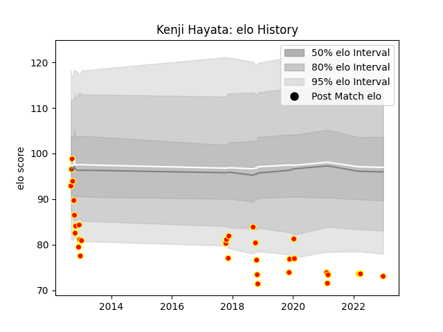

---  
layout: page  
title: Kenji Hayata  
date: 2023-03-02 11:20:22.564916  
categories: player  
---
# Kenji Hayata

## Positions: W, C

## Current elo: 65.0

## Current Percentile: None

# Elo History

# Match History

| Team          |   Appearances |   Win Rate |
|:--------------|--------------:|-----------:|
| Kyuden Voltex |            41 |   0.195122 |

| Opponent                         |   Matches |   Win Rate |
|:---------------------------------|----------:|-----------:|
| Kurita Water Gush                |         4 |   0.25     |
| NTT Docomo Red Hurricanes Osaka  |         4 |   0.25     |
| Toyota Industries Shuttles Aichi |         3 |   0        |
| Mazda Blue Zoomers               |         3 |   0.333333 |
| Munakata Sanix Blues             |         2 |   0        |
| Coca-Cola Red Sparks             |         2 |   0        |
| Urayasu D-Rocks                  |         2 |   0        |
| Toyota Verblitz                  |         2 |   0        |
| Kobelco Kobe Steelers            |         2 |   0        |
| Mitsubishi Dynaboars             |         2 |   0        |
| Skyactivs Hiroshima              |         2 |   1        |
| Shimizu Blue Sharks              |         1 |   0        |
| Toshiba Brave Lupus Tokyo        |         1 |   0        |
| Tokyo Sungoliath                 |         1 |   0        |
| Shizuoka Blue Revs               |         1 |   0        |
| Black Rams Tokyo                 |         1 |   1        |
| Saitama Wild Knights             |         1 |   0        |
| Chugoku Red Regulions            |         1 |   1        |
| Mie Honda Heat                   |         1 |   0        |
| Kamaishi Seawaves                |         1 |   1        |
| Hino Red Dolphins                |         1 |   0        |
| Hanazono Kintetsu Liners         |         1 |   0        |
| Green Rockets Tokatsu            |         1 |   0        |
| Yokohama Canon Eagles            |         1 |   0        |