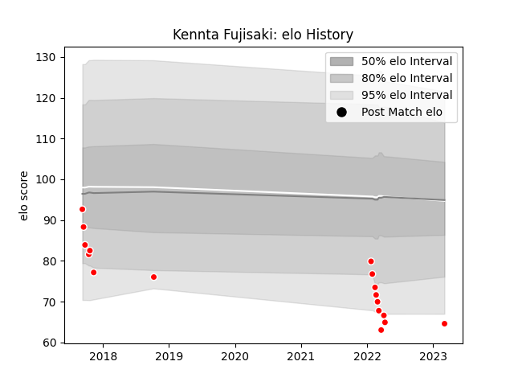

---  
layout: page  
title: Kennta Fujisaki  
date: 2023-03-09 10:13:01.362007  
categories: player  
---
# Kennta Fujisaki

## Positions: L

## Current elo: 65.0

## Current Percentile: 3.0

# Elo History

# Match History

| Team                  |   Appearances |   Win Rate |
|:----------------------|--------------:|-----------:|
| Chugoku Red Regulions |            17 |  0.0588235 |

| Opponent                         |   Matches |   Win Rate |
|:---------------------------------|----------:|-----------:|
| Kyuden Voltex                    |         3 |        0   |
| Kurita Water Gush                |         2 |        0.5 |
| Munakata Sanix Blues             |         2 |        0   |
| Shimizu Blue Sharks              |         2 |        0   |
| Toyota Industries Shuttles Aichi |         2 |        0   |
| Hanazono Kintetsu Liners         |         1 |        0   |
| Hino Red Dolphins                |         1 |        0   |
| Kamaishi Seawaves                |         1 |        0   |
| Mazda Blue Zoomers               |         1 |        0   |
| Mie Honda Heat                   |         1 |        0   |
| Mitsubishi Dynaboars             |         1 |        0   |