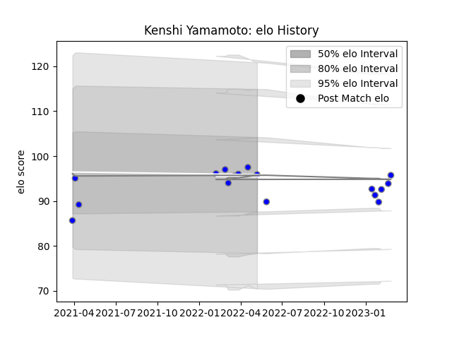

---  
layout: page  
title: Kenshi Yamamoto  
date: 2023-02-10 10:37:16.051885  
categories: player  
---
# Kenshi Yamamoto

## Positions: P

## Current elo: 96.0

## Current Percentile: None

# Elo History

# Match History

| Team                              |   Appearances |   Win Rate |
|:----------------------------------|--------------:|-----------:|
| Kubota Spears Funabashi Tokyo-Bay |            15 |        0.8 |

| Opponent                        |   Matches |   Win Rate |
|:--------------------------------|----------:|-----------:|
| Toyota Verblitz                 |         3 |   0.666667 |
| Green Rockets Tokatsu           |         2 |   1        |
| Toshiba Brave Lupus Tokyo       |         2 |   1        |
| Black Rams Tokyo                |         1 |   1        |
| Kobelco Kobe Steelers           |         1 |   1        |
| Mitsubishi Dynaboars            |         1 |   1        |
| NTT Docomo Red Hurricanes Osaka |         1 |   1        |
| Saitama Wild Knights            |         1 |   0        |
| Shizuoka Blue Revs              |         1 |   1        |
| Tokyo Sungoliath                |         1 |   0        |
| Yokohama Canon Eagles           |         1 |   1        |