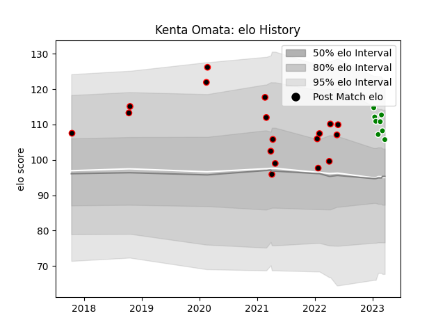

---  
layout: page  
title: Kenta Omata  
date: 2023-03-21 18:21:42.484676  
categories: player  
---
# Kenta Omata

Last updated: 2023-03-21
## Positions: W

## Current elo: 106.0

## Current Percentile: 80.0

# Elo History

# Match History

| Team                  |   Appearances |   Win Rate |
|:----------------------|--------------:|-----------:|
| Mie Honda Heat        |            18 |   0.555556 |
| Green Rockets Tokatsu |             8 |   0.125    |

| Opponent                          |   Matches |   Win Rate |
|:----------------------------------|----------:|-----------:|
| Mitsubishi Dynaboars              |         3 |        1   |
| Kamaishi Seawaves                 |         2 |        1   |
| Urayasu D-Rocks                   |         2 |        0   |
| Toshiba Brave Lupus Tokyo         |         2 |        0.5 |
| Kobelco Kobe Steelers             |         2 |        0   |
| Yokohama Canon Eagles             |         2 |        0.5 |
| Green Rockets Tokatsu             |         2 |        0.5 |
| Hino Red Dolphins                 |         1 |        1   |
| Hanazono Kintetsu Liners          |         1 |        0   |
| Kubota Spears Funabashi Tokyo-Bay |         1 |        0   |
| Chubu Electric Power              |         1 |        1   |
| Munakata Sanix Blues              |         1 |        0   |
| NTT Docomo Red Hurricanes Osaka   |         1 |        0   |
| Saitama Wild Knights              |         1 |        0   |
| Tokyo Sungoliath                  |         1 |        0   |
| Toyota Verblitz                   |         1 |        0   |
| Coca-Cola Red Sparks              |         1 |        1   |
| Black Rams Tokyo                  |         1 |        0   |