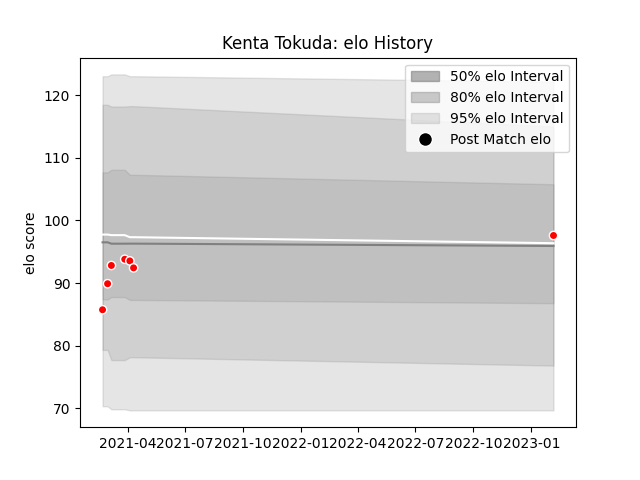

---  
layout: page  
title: Kenta Tokuda  
date: 2023-03-21 18:31:53.879717  
categories: player  
---
# Kenta Tokuda

Last updated: 2023-03-21
## Positions: SH

## Current elo: 100.0

## Current Percentile: 56.0

# Elo History

# Match History

| Team                  |   Appearances |   Win Rate |
|:----------------------|--------------:|-----------:|
| Kobelco Kobe Steelers |            10 |       0.75 |

| Opponent                        |   Matches |   Win Rate |
|:--------------------------------|----------:|-----------:|
| Green Rockets Tokatsu           |         2 |        1   |
| Black Rams Tokyo                |         1 |        0   |
| Hino Red Dolphins               |         1 |        1   |
| Mitsubishi Dynaboars            |         1 |        1   |
| NTT Docomo Red Hurricanes Osaka |         1 |        1   |
| Saitama Wild Knights            |         1 |        0.5 |
| Shizuoka Blue Revs              |         1 |        1   |
| Toshiba Brave Lupus Tokyo       |         1 |        0   |
| Yokohama Canon Eagles           |         1 |        1   |