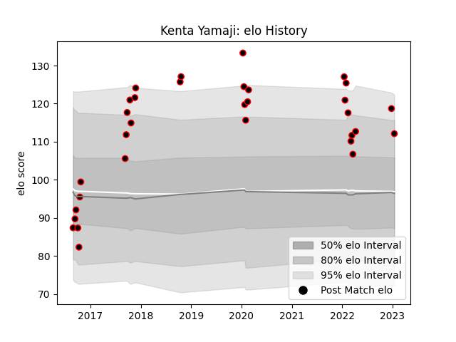

---  
layout: page  
title: Kenta Yamaji  
date: 2023-03-21 18:18:47.280090  
categories: player  
---
# Kenta Yamaji

Last updated: 2023-03-21
## Positions: SH

## Current elo: 104.0

## Current Percentile: 51.0

# Elo History

# Match History

| Team           |   Appearances |   Win Rate |
|:---------------|--------------:|-----------:|
| Mie Honda Heat |            55 |   0.527273 |

| Opponent                          |   Matches |   Win Rate |
|:----------------------------------|----------:|-----------:|
| Kubota Spears Funabashi Tokyo-Bay |         5 |       0.2  |
| Mitsubishi Dynaboars              |         4 |       0.75 |
| Hino Red Dolphins                 |         4 |       1    |
| Kamaishi Seawaves                 |         4 |       1    |
| Toshiba Brave Lupus Tokyo         |         4 |       0.25 |
| Toyota Verblitz                   |         3 |       0    |
| Hanazono Kintetsu Liners          |         3 |       0    |
| Tokyo Sungoliath                  |         3 |       0    |
| Munakata Sanix Blues              |         2 |       0    |
| Urayasu D-Rocks                   |         2 |       0    |
| Toyota Industries Shuttles Aichi  |         2 |       1    |
| Shimizu Blue Sharks               |         2 |       1    |
| Black Rams Tokyo                  |         2 |       1    |
| Green Rockets Tokatsu             |         2 |       1    |
| Coca-Cola Red Sparks              |         2 |       0.5  |
| Yokohama Canon Eagles             |         2 |       1    |
| Chubu Electric Power              |         1 |       1    |
| NTT Docomo Red Hurricanes Osaka   |         1 |       0    |
| Saitama Wild Knights              |         1 |       0    |
| Mazda Blue Zoomers                |         1 |       1    |
| Shizuoka Blue Revs                |         1 |       0    |
| Skyactivs Hiroshima               |         1 |       1    |
| Kyuden Voltex                     |         1 |       1    |
| Kobelco Kobe Steelers             |         1 |       0    |
| Chugoku Red Regulions             |         1 |       1    |