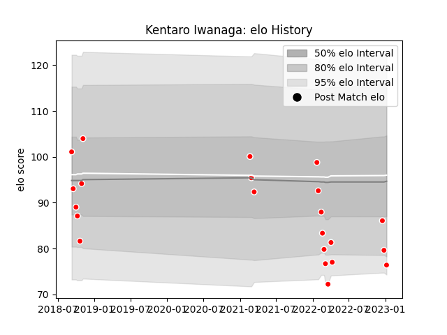

---  
layout: page  
title: Kentaro Iwanaga  
date: 2022-12-28 12:55:16.212417  
categories: player  
---
# Kentaro Iwanaga

## Positions: H

## Current elo: 82.0

## Current Percentile: 7.0

# Elo History

# Match History

| Team                  |   Appearances |   Win Rate |
|:----------------------|--------------:|-----------:|
| Chugoku Red Regulions |            21 |   0.142857 |

| Opponent                         |   Matches |   Win Rate |
|:---------------------------------|----------:|-----------:|
| Kurita Water Gush                |         3 |   0.333333 |
| Kyuden Voltex                    |         3 |   0        |
| Toyota Industries Shuttles Aichi |         3 |   0        |
| Munakata Sanix Blues             |         2 |   0        |
| NTT Docomo Red Hurricanes Osaka  |         2 |   0        |
| Shimizu Blue Sharks              |         2 |   0        |
| Coca-Cola Red Sparks             |         1 |   0        |
| Hanazono Kintetsu Liners         |         1 |   0        |
| Kamaishi Seawaves                |         1 |   0        |
| Mazda Blue Zoomers               |         1 |   1        |
| Mitsubishi Dynaboars             |         1 |   0        |
| Skyactivs Hiroshima              |         1 |   1        |