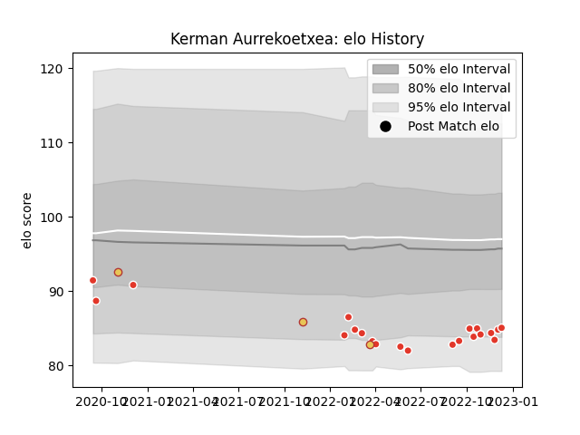

---  
layout: page  
title: Kerman Aurrekoetxea  
date: 2022-11-16 11:36:27.942291  
categories: player  
---
# Kerman Aurrekoetxea

## Positions: SH

## Country: Spain

## Current elo: 84.0

## Current Percentile: 5.0

# Elo History

# Match History

| Team               |   Appearances |   Win Rate |
|:-------------------|--------------:|-----------:|
| Biarritz Olympique |            17 |   0.264706 |
| Spain              |             5 |   0.4      |

| Opponent             |   Matches |   Win Rate |
|:---------------------|----------:|-----------:|
| Nevers               |         2 |       0.25 |
| Montauban            |         2 |       0.5  |
| Agen                 |         1 |       0    |
| Uruguay              |         1 |       1    |
| Toulon               |         1 |       0    |
| Tonga                |         1 |       0    |
| Stade Toulousain     |         1 |       0    |
| Stade Francais Paris |         1 |       0    |
| Rouen                |         1 |       0    |
| Pau                  |         1 |       0    |
| Namibia              |         1 |       1    |
| Beziers              |         1 |       1    |
| Montpellier Herault  |         1 |       0    |
| La Rochelle          |         1 |       1    |
| Georgia              |         1 |       0    |
| Fiji                 |         1 |       0    |
| Colomiers            |         1 |       1    |
| Clermont Auvergne    |         1 |       0    |
| Brive                |         1 |       0    |
| Vannes               |         1 |       0    |