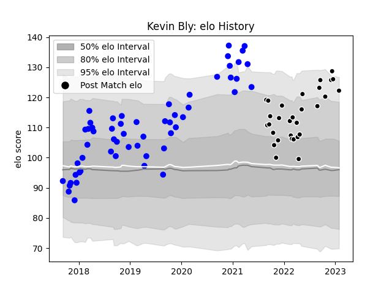

---  
layout: page  
title: Kevin Bly  
date: 2023-01-30 11:44:08.182719  
categories: player  
---
# Kevin Bly

## Positions: W

## Current elo: 122.0

## Current Percentile: 94.0

# Elo History

# Match History

| Team           |   Appearances |   Win Rate |
|:---------------|--------------:|-----------:|
| Vannes         |            56 |   0.517857 |
| Provence Rugby |            30 |   0.566667 |

| Opponent           |   Matches |   Win Rate |
|:-------------------|----------:|-----------:|
| Montauban          |         8 |   0.625    |
| Aurillac           |         7 |   0.714286 |
| Carcassonne        |         6 |   0.75     |
| Nevers             |         6 |   0.333333 |
| Beziers            |         5 |   0.6      |
| Oyonnax            |         5 |   0.8      |
| Mont-de-Marsan     |         4 |   0.75     |
| Rouen              |         4 |   0.5      |
| Colomiers          |         4 |   0.5      |
| Soyaux-Angouleme   |         3 |   0.666667 |
| Provence Rugby     |         3 |   0.333333 |
| Narbonne           |         3 |   0.333333 |
| Agen               |         3 |   0.333333 |
| Massy              |         3 |   0.666667 |
| Grenoble           |         3 |   0.666667 |
| Biarritz Olympique |         3 |   0        |
| Bayonne            |         3 |   0.333333 |
| Vannes             |         3 |   0.333333 |
| Dax                |         2 |   0.5      |
| Perpignan          |         2 |   0        |
| Brive              |         2 |   0        |
| Roval Drome XV     |         2 |   1        |
| US Bressane        |         2 |   0.75     |