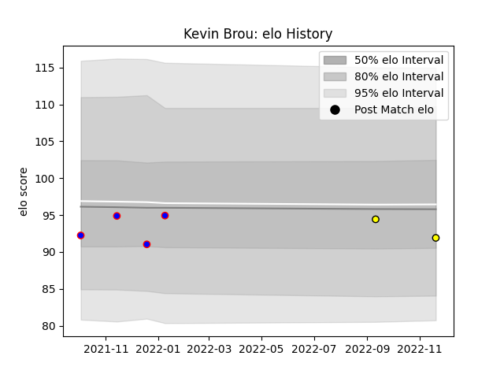

---  
layout: page  
title: Kevin Brou  
date: 2023-01-23 15:35:06.316450  
categories: player  
---
# Kevin Brou

## Positions: P

## Current elo: 87.0

## Current Percentile: 22.0

# Elo History

# Match History

| Team   |   Appearances |   Win Rate |
|:-------|--------------:|-----------:|
| Dijon  |            16 |   0.375    |
| Albi   |             3 |   0.666667 |

| Opponent                   |   Matches |   Win Rate |
|:---------------------------|----------:|-----------:|
| Tarbes                     |         3 |   0.166667 |
| Albi                       |         2 |   0        |
| Aubenas                    |         2 |   0.75     |
| Blagnac                    |         2 |   0.5      |
| Bourgoin-Jallieu           |         2 |   0.5      |
| Carqueiranne-Hyères        |         1 |   1        |
| Chambery                   |         1 |   0        |
| Cognac Saint Jean d'Angély |         1 |   0        |
| Dax                        |         1 |   0        |
| Massy                      |         1 |   0        |
| Rennes                     |         1 |   1        |
| Soyaux-Angouleme           |         1 |   1        |
| Valence Romans Drome Rugby |         1 |   1        |