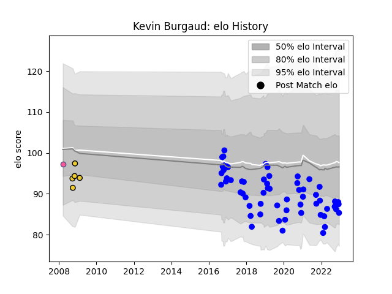

---  
layout: page  
title: Kevin Burgaud  
date: 2022-12-14 11:13:20.108988  
categories: player  
---
# Kevin Burgaud

## Positions: C

## Current elo: 85.0

## Current Percentile: 21.0

# Elo History

# Match History

| Team                 |   Appearances |   Win Rate |
|:---------------------|--------------:|-----------:|
| Vannes               |            60 |   0.408333 |
| La Rochelle          |             5 |   0.6      |
| Stade Francais Paris |             1 |   0        |

| Opponent                   |   Matches |   Win Rate |
|:---------------------------|----------:|-----------:|
| Colomiers                  |         7 |   0.571429 |
| Aurillac                   |         6 |   0.166667 |
| Mont-de-Marsan             |         6 |   0.166667 |
| Montauban                  |         5 |   0.5      |
| Oyonnax                    |         4 |   0.25     |
| Carcassonne                |         4 |   0.5      |
| US Bressane                |         3 |   1        |
| Bayonne                    |         3 |   0.333333 |
| Grenoble                   |         3 |   0.333333 |
| Provence Rugby             |         2 |   0.5      |
| Perpignan                  |         2 |   0.5      |
| Dax                        |         2 |   0        |
| Narbonne                   |         2 |   0.25     |
| Soyaux-Angouleme           |         2 |   0.5      |
| Bordeaux Begles            |         2 |   0.5      |
| Biarritz Olympique         |         2 |   0        |
| Beziers                    |         2 |   0.5      |
| Roval Drome XV             |         1 |   1        |
| Agen                       |         1 |   0        |
| Massy                      |         1 |   1        |
| Albi                       |         1 |   1        |
| Clermont Auvergne          |         1 |   0        |
| Brive                      |         1 |   0        |
| Bourgoin-Jallieu           |         1 |   0.5      |
| Auch                       |         1 |   1        |
| Valence Romans Drome Rugby |         1 |   1        |