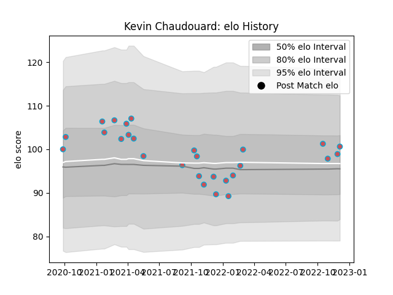

---  
layout: page  
title: Kevin Chaudouard  
date: 2023-01-15 11:43:31.963637  
categories: player  
---
# Kevin Chaudouard

## Positions: FL

## Current elo: 95.0

## Current Percentile: 55.0

# Elo History

# Match History

| Team             |   Appearances |   Win Rate |
|:-----------------|--------------:|-----------:|
| Bourgoin-Jallieu |            38 |   0.368421 |

| Opponent                   |   Matches |   Win Rate |
|:---------------------------|----------:|-----------:|
| Tarbes                     |         5 |   0.2      |
| Albi                       |         4 |   0.25     |
| Cognac Saint Jean d'Angély |         4 |   0.75     |
| Nice                       |         4 |   0.25     |
| Aubenas                    |         3 |   0.333333 |
| Blagnac                    |         3 |   0.333333 |
| Chambery                   |         3 |   0.666667 |
| Massy                      |         3 |   0.333333 |
| Dax                        |         2 |   0        |
| Narbonne                   |         2 |   0        |
| Dijon                      |         1 |   1        |
| Rennes                     |         1 |   1        |
| Soyaux-Angouleme           |         1 |   0        |
| US Bressane                |         1 |   0        |
| Valence Romans Drome Rugby |         1 |   1        |