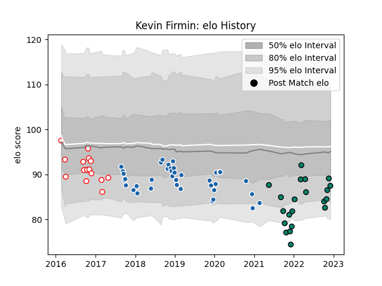

---  
layout: page  
title: Kevin Firmin  
date: 2022-12-09 13:15:36.132298  
categories: player  
---
# Kevin Firmin

## Positions: H

## Current elo: 87.0

## Current Percentile: 21.0

# Elo History

# Match History

| Team              |   Appearances |   Win Rate |
|:------------------|--------------:|-----------:|
| Castres Olympique |            38 |   0.447368 |
| Montauban         |            21 |   0.5      |
| Dax               |            15 |   0.466667 |

| Opponent            |   Matches |   Win Rate |
|:--------------------|----------:|-----------:|
| Racing 92           |         5 |   0.4      |
| Colomiers           |         4 |   0.5      |
| Agen                |         3 |   0.333333 |
| Pau                 |         3 |   0.666667 |
| Munster             |         3 |   0.333333 |
| Montpellier Herault |         3 |   0.666667 |
| Aurillac            |         3 |   0.333333 |
| Lyon                |         3 |   0.666667 |
| La Rochelle         |         3 |   0        |
| Mont-de-Marsan      |         3 |   0.666667 |
| Clermont Auvergne   |         3 |   0.333333 |
| Vannes              |         2 |   1        |
| Grenoble            |         2 |   0.75     |
| Carcassonne         |         2 |   0.5      |
| Soyaux-Angouleme    |         2 |   0.5      |
| Rouen               |         2 |   0.5      |
| Bayonne             |         2 |   0        |
| Montauban           |         2 |   0.5      |
| Provence Rugby      |         2 |   0        |
| Biarritz Olympique  |         2 |   0.5      |
| Perpignan           |         2 |   1        |
| Dragons             |         2 |   0.5      |
| Oyonnax             |         1 |   1        |
| Toulon              |         1 |   0        |
| RC Enisei           |         1 |   1        |
| Beziers             |         1 |   0        |
| Nevers              |         1 |   1        |
| Ospreys             |         1 |   0        |
| Newcastle Falcons   |         1 |   0        |
| Narbonne            |         1 |   0        |
| Bordeaux Begles     |         1 |   0        |
| Bourgoin-Jallieu    |         1 |   0        |
| Massy               |         1 |   1        |
| Brive               |         1 |   0        |
| Leicester Tigers    |         1 |   1        |
| Gloucester Rugby    |         1 |   1        |
| Exeter Chiefs       |         1 |   0        |
| Worcester Warriors  |         1 |   1        |