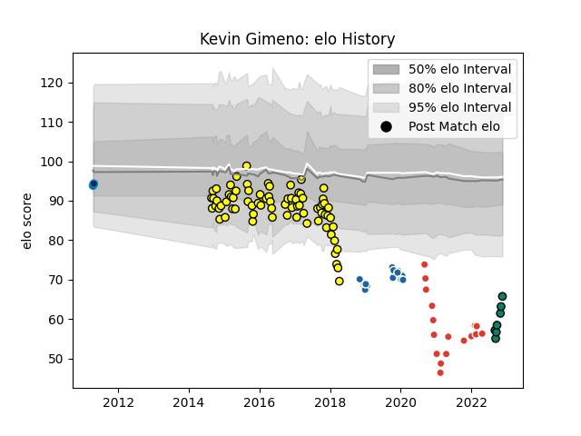

---  
layout: page  
title: Kevin Gimeno  
date: 2022-11-22 11:41:56.390129  
categories: player  
---
# Kevin Gimeno

## Positions: FL, L

## Current elo: 66.0

## Current Percentile: 0.0

# Elo History

# Match History

| Team                |   Appearances |   Win Rate |
|:--------------------|--------------:|-----------:|
| Carcassonne         |            74 |   0.418919 |
| Biarritz Olympique  |            17 |   0.382353 |
| Castres Olympique   |            16 |   0.5      |
| Montauban           |             7 |   0.571429 |
| Montpellier Herault |             2 |   0        |

| Opponent                   |   Matches |   Win Rate |
|:---------------------------|----------:|-----------:|
| Mont-de-Marsan             |         9 |   0.388889 |
| Beziers                    |         7 |   0.285714 |
| Montauban                  |         7 |   0.142857 |
| Colomiers                  |         6 |   0.666667 |
| Biarritz Olympique         |         6 |   0.666667 |
| Perpignan                  |         5 |   0.4      |
| Narbonne                   |         5 |   0.6      |
| Dax                        |         5 |   1        |
| Albi                       |         4 |   0.25     |
| Massy                      |         4 |   0.5      |
| Agen                       |         4 |   0.25     |
| Bayonne                    |         4 |   0.25     |
| Soyaux-Angouleme           |         3 |   0.666667 |
| Vannes                     |         3 |   0.666667 |
| Grenoble                   |         3 |   0.333333 |
| La Rochelle                |         3 |   0.333333 |
| Provence Rugby             |         3 |   0.333333 |
| Aurillac                   |         3 |   0.333333 |
| Bourgoin-Jallieu           |         3 |   0.666667 |
| Pau                        |         3 |   0.666667 |
| Nevers                     |         2 |   0        |
| Racing 92                  |         2 |   0        |
| Carcassonne                |         2 |   0        |
| Worcester Warriors         |         2 |   1        |
| Stade Francais Paris       |         2 |   0.5      |
| Tarbes                     |         2 |   1        |
| Lyon                       |         2 |   0        |
| Munster                    |         2 |   0.5      |
| Toulon                     |         1 |   0        |
| Stade Toulousain           |         1 |   0        |
| Valence Romans Drome Rugby |         1 |   0        |
| Castres Olympique          |         1 |   0        |
| RC Enisei                  |         1 |   1        |
| Bordeaux Begles            |         1 |   0        |
| Brive                      |         1 |   0        |
| Gloucester Rugby           |         1 |   1        |
| Dragons                    |         1 |   0        |
| Oyonnax                    |         1 |   0        |