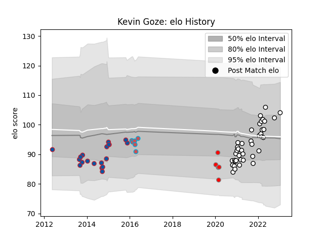

---  
layout: page  
title: Kevin Goze  
date: 2023-03-21 18:56:37.625556  
categories: player  
---
# Kevin Goze

Last updated: 2023-03-21
## Positions: P

## Current elo: 97.0

## Current Percentile: 64.0

# Elo History

# Match History

| Team                       |   Appearances |   Win Rate |
|:---------------------------|--------------:|-----------:|
| Valence Romans Drome Rugby |            42 |    0.52381 |
| Grenoble                   |            20 |    0.475   |
| Bourgoin-Jallieu           |             6 |    0.5     |
| Roval Drome XV             |             5 |    0       |

| Opponent                   |   Matches |   Win Rate |
|:---------------------------|----------:|-----------:|
| Soyaux-Angouleme           |         6 |   0.25     |
| Provence Rugby             |         4 |   0        |
| Oyonnax                    |         4 |   0.25     |
| Dax                        |         3 |   0.666667 |
| Bayonne                    |         3 |   0.333333 |
| Beziers                    |         3 |   0.166667 |
| Nice                       |         3 |   1        |
| Montauban                  |         3 |   0.333333 |
| Grenoble                   |         2 |   0        |
| Tarbes                     |         2 |   1        |
| Suresnes                   |         2 |   1        |
| Stade Toulousain           |         2 |   0.5      |
| Rouen                      |         2 |   0.5      |
| Perpignan                  |         2 |   0        |
| Arix Viadana               |         2 |   0.75     |
| Vannes                     |         2 |   0.5      |
| Castres Olympique          |         2 |   0.5      |
| Cognac Saint Jean d'Angély |         2 |   1        |
| Aurillac                   |         2 |   0.5      |
| Biarritz Olympique         |         2 |   0.5      |
| Chambery                   |         2 |   1        |
| Bourgoin-Jallieu           |         1 |   1        |
| Aubenas                    |         1 |   1        |
| Blagnac                    |         1 |   0        |
| Rugby Rovigo               |         1 |   1        |
| Rovigo                     |         1 |   1        |
| Bordeaux Begles            |         1 |   0        |
| Racing 92                  |         1 |   1        |
| Colomiers                  |         1 |   0        |
| Carcassonne                |         1 |   1        |
| Dijon                      |         1 |   1        |
| Narbonne                   |         1 |   1        |
| Clermont Auvergne          |         1 |   0        |
| Mont-de-Marsan             |         1 |   0        |
| Massy                      |         1 |   0        |
| London Irish               |         1 |   0        |
| La Rochelle                |         1 |   1        |
| Edinburgh                  |         1 |   0        |
| Albi                       |         1 |   0        |