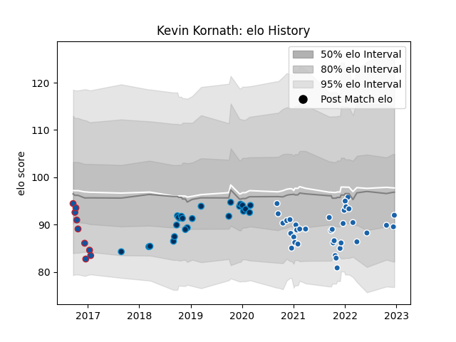

---  
layout: page  
title: Kevin Kornath  
date: 2022-12-14 11:30:25.072673  
categories: player  
---
# Kevin Kornath

## Positions: FL, N8

## Current elo: 90.0

## Current Percentile: 21.0

# Elo History

# Match History

| Team                |   Appearances |   Win Rate |
|:--------------------|--------------:|-----------:|
| Castres Olympique   |            35 |   0.457143 |
| Montpellier Herault |            24 |   0.5      |
| Grenoble            |             9 |   0.222222 |

| Opponent             |   Matches |   Win Rate |
|:---------------------|----------:|-----------:|
| Stade Toulousain     |         6 |   0.166667 |
| La Rochelle          |         5 |   0.4      |
| Racing 92            |         5 |   0.4      |
| Stade Francais Paris |         5 |   0.2      |
| Toulon               |         5 |   0.6      |
| Agen                 |         4 |   1        |
| Pau                  |         4 |   0.75     |
| Bordeaux Begles      |         4 |   0.25     |
| Lyon                 |         4 |   0.25     |
| Newcastle Falcons    |         4 |   0.5      |
| Brive                |         3 |   0.666667 |
| Montpellier Herault  |         3 |   0.666667 |
| Ospreys              |         3 |   0        |
| Perpignan            |         2 |   1        |
| Bayonne              |         2 |   0.5      |
| Clermont Auvergne    |         2 |   0.5      |
| Biarritz Olympique   |         1 |   1        |
| Castres Olympique    |         1 |   0        |
| Harlequins           |         1 |   0        |
| Gloucester Rugby     |         1 |   0        |
| Exeter Chiefs        |         1 |   0        |
| Edinburgh            |         1 |   1        |
| Munster              |         1 |   0        |