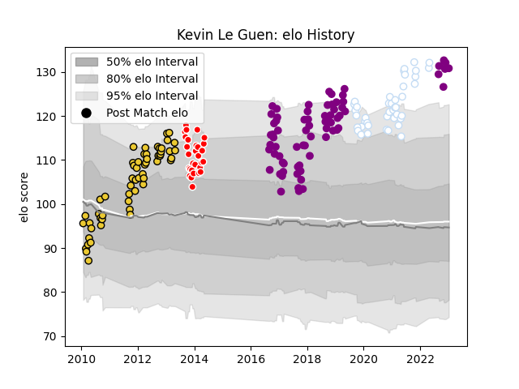

---  
layout: page  
title: Kevin Le Guen  
date: 2023-01-13 11:31:13.224387  
categories: player  
---
# Kevin Le Guen

## Positions: H

## Current elo: 131.0

## Current Percentile: 98.0

# Elo History

# Match History

| Team             |   Appearances |   Win Rate |
|:-----------------|--------------:|-----------:|
| Soyaux-Angouleme |            71 |   0.521127 |
| La Rochelle      |            56 |   0.642857 |
| Racing 92        |            42 |   0.583333 |
| Auch             |            29 |   0.327586 |

| Opponent             |   Matches |   Win Rate |
|:---------------------|----------:|-----------:|
| Aurillac             |        12 |   0.416667 |
| Colomiers            |        10 |   0.55     |
| Narbonne             |        10 |   0.6      |
| Dax                  |        10 |   0.55     |
| Mont-de-Marsan       |         9 |   0.333333 |
| Beziers              |         9 |   0.666667 |
| Carcassonne          |         9 |   0.444444 |
| Lyon                 |         8 |   0.25     |
| Pau                  |         7 |   0.857143 |
| Oyonnax              |         7 |   0.285714 |
| La Rochelle          |         7 |   0.285714 |
| Agen                 |         7 |   0.642857 |
| Vannes               |         6 |   0.666667 |
| Bourgoin-Jallieu     |         6 |   0.833333 |
| Castres Olympique    |         5 |   0.8      |
| Brive                |         5 |   0.4      |
| Toulon               |         5 |   0.2      |
| Tarbes               |         5 |   0.6      |
| Stade Toulousain     |         5 |   0.4      |
| Albi                 |         5 |   0.3      |
| Provence Rugby       |         5 |   0.8      |
| Biarritz Olympique   |         5 |   0.8      |
| Auch                 |         4 |   1        |
| Bayonne              |         4 |   0.5      |
| Nevers               |         4 |   0.5      |
| Montpellier Herault  |         3 |   0.333333 |
| Perpignan            |         3 |   0.333333 |
| Montauban            |         3 |   0.666667 |
| Stade Francais Paris |         3 |   0.666667 |
| Bordeaux Begles      |         3 |   0.666667 |
| Grenoble             |         3 |   0.333333 |
| US Bressane          |         3 |   0.666667 |
| Massy                |         2 |   1        |
| Clermont Auvergne    |         2 |   1        |
| Ospreys              |         1 |   1        |
| Périgueux            |         1 |   1        |
| Racing 92            |         1 |   0        |
| Saracens             |         1 |   0        |