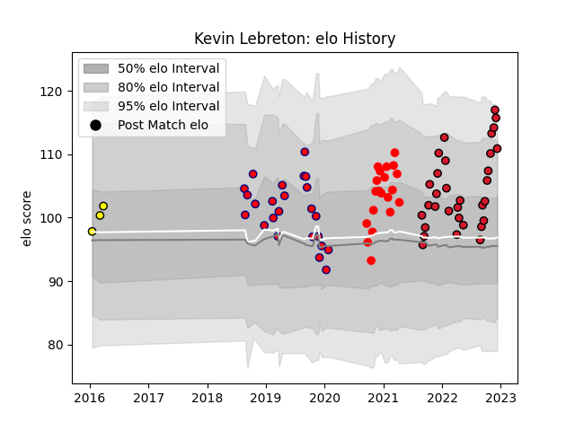

---  
layout: page  
title: Kevin Lebreton  
date: 2023-01-13 11:34:08.029462  
categories: player  
---
# Kevin Lebreton

## Positions: FL, N8

## Current elo: 133.0

## Current Percentile: 95.0

# Elo History

# Match History

| Team     |   Appearances |   Win Rate |
|:---------|--------------:|-----------:|
| Aurillac |            42 |   0.309524 |
| Oyonnax  |            37 |   0.810811 |
| Rouen    |            22 |   0.386364 |
| Albi     |             3 |   0.5      |

| Opponent                   |   Matches |   Win Rate |
|:---------------------------|----------:|-----------:|
| Mont-de-Marsan             |         8 |   0.25     |
| Colomiers                  |         8 |   0.125    |
| Provence Rugby             |         7 |   0.571429 |
| Biarritz Olympique         |         7 |   0.142857 |
| Carcassonne                |         7 |   0.714286 |
| Nevers                     |         7 |   0.428571 |
| Grenoble                   |         7 |   0.428571 |
| Vannes                     |         6 |   0.5      |
| Beziers                    |         6 |   0.583333 |
| Oyonnax                    |         5 |   0.6      |
| Aurillac                   |         5 |   0.6      |
| Montauban                  |         5 |   0.6      |
| Soyaux-Angouleme           |         4 |   0.5      |
| Bayonne                    |         3 |   0.666667 |
| Rouen                      |         3 |   1        |
| US Bressane                |         3 |   0.666667 |
| Agen                       |         3 |   1        |
| Massy                      |         2 |   1        |
| Narbonne                   |         2 |   1        |
| Perpignan                  |         2 |   0        |
| Dax                        |         1 |   0.5      |
| Brive                      |         1 |   1        |
| Roval Drome XV             |         1 |   0        |
| Valence Romans Drome Rugby |         1 |   1        |