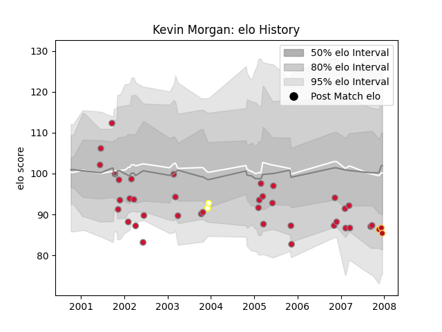

---  
layout: page  
title: Kevin Morgan  
date: 2023-03-09 10:10:25.831641  
categories: player  
---
# Kevin Morgan

## Positions: FB, W

## Country: Wales

## Current elo: 85.0

## Current Percentile: 17.0

# Elo History

# Match History

| Team            |   Appearances |   Win Rate |
|:----------------|--------------:|-----------:|
| Wales           |            37 |   0.527027 |
| Swansea         |            13 |   0.384615 |
| EbbwaleNewport  |             8 |   0.375    |
| Dragons         |             3 |   0.333333 |
| Celtic Warriors |             2 |   0.5      |

| Opponent                 |   Matches |   Win Rate |
|:-------------------------|----------:|-----------:|
| Italy                    |         4 |   0.75     |
| Scotland                 |         4 |   0.25     |
| Edinburgh                |         4 |   0.75     |
| England                  |         4 |   0.5      |
| Ireland                  |         4 |   0.25     |
| Japan                    |         3 |   1        |
| Perpignan                |         3 |   0.333333 |
| Canada                   |         3 |   1        |
| France                   |         3 |   0.333333 |
| South Africa             |         2 |   0        |
| Newcastle Falcons        |         2 |   0        |
| New Zealand              |         2 |   0        |
| L' Aquila                |         2 |   1        |
| Australia                |         2 |   0.25     |
| Wasps                    |         2 |   0.5      |
| Biarritz Olympique       |         2 |   0.5      |
| Benetton Treviso         |         2 |   0.5      |
| Bath Rugby               |         2 |   0        |
| Fiji                     |         1 |   1        |
| Clermont Auvergne        |         1 |   0        |
| Leicester Tigers         |         1 |   0        |
| London Irish             |         1 |   0        |
| Castres Olympique        |         1 |   0        |
| Calvisano                |         1 |   1        |
| Pacific Islands          |         1 |   1        |
| Romania                  |         1 |   1        |
| Sale Sharks              |         1 |   0        |
| Stade Francais Paris     |         1 |   0        |
| Tonga                    |         1 |   1        |
| United States of America |         1 |   1        |
| Argentina                |         1 |   0        |