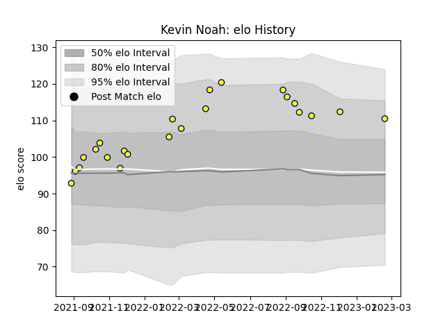

---  
layout: page  
title: Kevin Noah  
date: 2023-02-24 02:24:17.766162  
categories: player  
---
# Kevin Noah

## Positions: FL, N8

## Current elo: 110.0

## Current Percentile: 86.0

# Elo History

# Match History

| Team   |   Appearances |   Win Rate |
|:-------|--------------:|-----------:|
| Nevers |            23 |   0.586957 |

| Opponent           |   Matches |   Win Rate |
|:-------------------|----------:|-----------:|
| Beziers            |         3 |   0.833333 |
| Colomiers          |         3 |   0.333333 |
| Montauban          |         3 |   0.333333 |
| Oyonnax            |         2 |   0.5      |
| Rouen              |         2 |   1        |
| US Bressane        |         2 |   1        |
| Bayonne            |         1 |   0.5      |
| Biarritz Olympique |         1 |   0.5      |
| Grenoble           |         1 |   0        |
| Mont-de-Marsan     |         1 |   0        |
| Narbonne           |         1 |   1        |
| Provence Rugby     |         1 |   0        |
| Soyaux-Angouleme   |         1 |   1        |
| Vannes             |         1 |   1        |