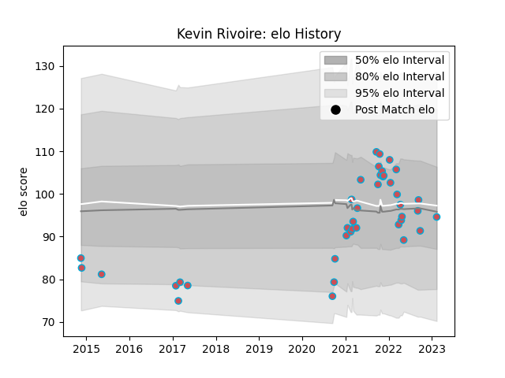

---  
layout: page  
title: Kevin Rivoire  
date: 2023-02-15 22:14:59.697057  
categories: player  
---
# Kevin Rivoire

## Positions: FL, N8

## Current elo: 95.0

## Current Percentile: 38.0

# Elo History

# Match History

| Team             |   Appearances |   Win Rate |
|:-----------------|--------------:|-----------:|
| Bourgoin-Jallieu |            40 |      0.425 |

| Opponent                   |   Matches |   Win Rate |
|:---------------------------|----------:|-----------:|
| Dax                        |         5 |   0.4      |
| Dijon                      |         4 |   0.75     |
| Chambery                   |         4 |   0.5      |
| Suresnes                   |         3 |   0.666667 |
| Massy                      |         3 |   0.333333 |
| Narbonne                   |         2 |   0.5      |
| Tarbes                     |         2 |   0.5      |
| Soyaux-Angouleme           |         2 |   0        |
| Nice                       |         2 |   0        |
| Albi                       |         2 |   0        |
| Valence Romans Drome Rugby |         1 |   1        |
| Perpignan                  |         1 |   0        |
| Agen                       |         1 |   0        |
| Montauban                  |         1 |   0        |
| Cognac Saint Jean d'Angély |         1 |   1        |
| Carqueiranne-Hyères        |         1 |   1        |
| Blagnac                    |         1 |   1        |
| Biarritz Olympique         |         1 |   0        |
| Aurillac                   |         1 |   0        |
| Aubenas                    |         1 |   1        |
| Vannes                     |         1 |   0        |