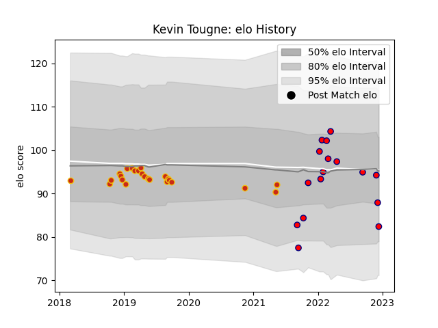

---  
layout: page  
title: Kevin Tougne  
date: 2022-12-18 16:15:36.674259  
categories: player  
---
# Kevin Tougne

## Positions: P

## Current elo: 94.0

## Current Percentile: 50.0

# Elo History

# Match History

| Team      |   Appearances |   Win Rate |
|:----------|--------------:|-----------:|
| Perpignan |            15 |   0.166667 |

| Opponent            |   Matches |   Win Rate |
|:--------------------|----------:|-----------:|
| Bordeaux Begles     |         3 |   0.166667 |
| Connacht            |         2 |   0        |
| Racing 92           |         2 |   0        |
| Sale Sharks         |         2 |   0        |
| Grenoble            |         1 |   1        |
| La Rochelle         |         1 |   0        |
| Lyon                |         1 |   0        |
| Montpellier Herault |         1 |   1        |
| Stade Toulousain    |         1 |   0        |
| Toulon              |         1 |   0        |