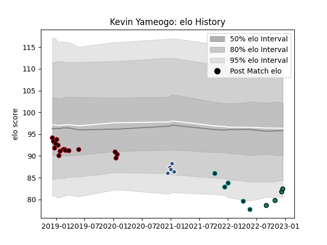

---  
layout: page  
title: Kevin Yameogo  
date: 2022-12-14 11:11:38.724040  
categories: player  
---
# Kevin Yameogo

## Positions: P

## Current elo: 82.0

## Current Percentile: 3.0

# Elo History

# Match History

| Team      |   Appearances |   Win Rate |
|:----------|--------------:|-----------:|
| Lyon      |            16 |        0.5 |
| Agen      |             5 |        0   |
| Pau       |             5 |        0.2 |
| Montauban |             3 |        0   |

| Opponent             |   Matches |   Win Rate |
|:---------------------|----------:|-----------:|
| Toulon               |         4 |        0.5 |
| Stade Toulousain     |         2 |        0   |
| Castres Olympique    |         2 |        0   |
| Racing 92            |         2 |        0.5 |
| Glasgow Warriors     |         2 |        0   |
| London Irish         |         2 |        0   |
| Montpellier Herault  |         1 |        1   |
| Stade Francais Paris |         1 |        1   |
| Saracens             |         1 |        0   |
| Provence Rugby       |         1 |        0   |
| Oyonnax              |         1 |        0   |
| Northampton Saints   |         1 |        0   |
| Agen                 |         1 |        1   |
| Brive                |         1 |        1   |
| La Rochelle          |         1 |        0   |
| Grenoble             |         1 |        1   |
| Edinburgh            |         1 |        0   |
| Clermont Auvergne    |         1 |        1   |
| Cardiff Blues        |         1 |        0   |
| Carcassonne          |         1 |        0   |
| Leinster             |         1 |        0   |