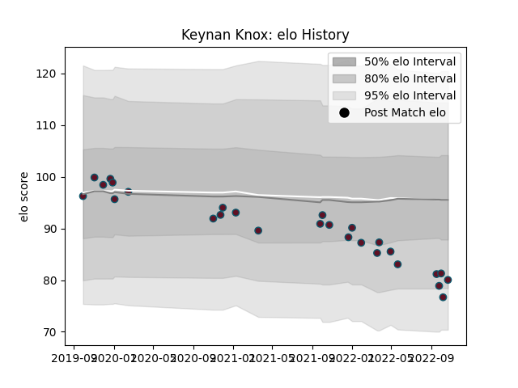

---  
layout: page  
title: Keynan Knox  
date: 2023-03-04 11:43:50.462146  
categories: player  
---
# Keynan Knox

## Positions: P

## Current elo: 80.0

## Current Percentile: 8.0

# Elo History

# Match History

| Team    |   Appearances |   Win Rate |
|:--------|--------------:|-----------:|
| Munster |            27 |   0.592593 |

| Opponent          |   Matches |   Win Rate |
|:------------------|----------:|-----------:|
| Connacht          |         4 |   0.5      |
| Cardiff Blues     |         3 |   0.666667 |
| Dragons           |         3 |   0.666667 |
| Leinster          |         3 |   0        |
| Zebre             |         3 |   1        |
| Benetton Treviso  |         2 |   1        |
| Castres Olympique |         1 |   1        |
| Edinburgh         |         1 |   0        |
| Glasgow Warriors  |         1 |   1        |
| Lions             |         1 |   0        |
| Ospreys           |         1 |   0        |
| Sharks            |         1 |   1        |
| Southern Kings    |         1 |   1        |
| Stormers          |         1 |   1        |
| Ulster            |         1 |   0        |