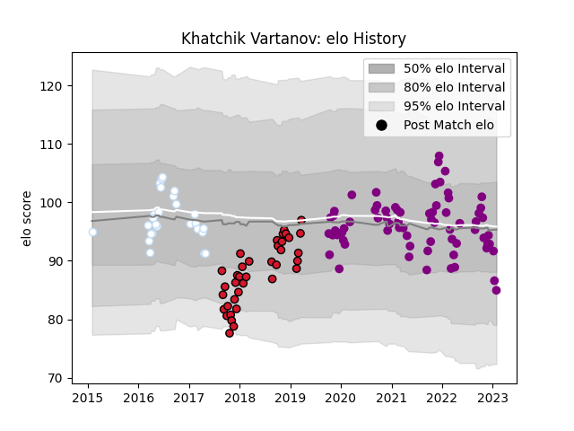

---  
layout: page  
title: Khatchik Vartanov  
date: 2022-12-14 11:11:37.969222  
categories: player  
---
# Khatchik Vartanov

## Positions: P

## Current elo: 91.0

## Current Percentile: 27.0

# Elo History

# Match History

| Team             |   Appearances |   Win Rate |
|:-----------------|--------------:|-----------:|
| Soyaux-Angouleme |            46 |   0.456522 |
| Oyonnax          |            26 |   0.288462 |
| Racing 92        |            26 |   0.576923 |

| Opponent                   |   Matches |   Win Rate |
|:---------------------------|----------:|-----------:|
| Massy                      |         5 |   0.8      |
| Toulon                     |         5 |   0.6      |
| Stade Toulousain           |         5 |   0.5      |
| Brive                      |         5 |   0.2      |
| Montpellier Herault        |         5 |   0.2      |
| Vannes                     |         4 |   0.5      |
| Mont-de-Marsan             |         3 |   0.333333 |
| Biarritz Olympique         |         3 |   0        |
| Bordeaux Begles            |         3 |   0.666667 |
| Stade Francais Paris       |         3 |   0.333333 |
| Carcassonne                |         3 |   0.5      |
| Grenoble                   |         3 |   0        |
| Clermont Auvergne          |         3 |   0.5      |
| Nevers                     |         3 |   0.166667 |
| Nice                       |         2 |   0.5      |
| Lyon                       |         2 |   0.5      |
| Oyonnax                    |         2 |   0        |
| Pau                        |         2 |   0.5      |
| Racing 92                  |         2 |   0        |
| Albi                       |         2 |   1        |
| Valence Romans Drome Rugby |         2 |   0.5      |
| Rouen                      |         2 |   0        |
| Worcester Warriors         |         2 |   0.5      |
| Dijon                      |         2 |   0.5      |
| Dax                        |         2 |   0.5      |
| Colomiers                  |         2 |   0.5      |
| Blagnac                    |         2 |   1        |
| La Rochelle                |         2 |   0.75     |
| Leicester Tigers           |         1 |   1        |
| Saracens                   |         1 |   0        |
| Aurillac                   |         1 |   1        |
| Bayonne                    |         1 |   1        |
| US Bressane                |         1 |   1        |
| Beziers                    |         1 |   1        |
| Suresnes                   |         1 |   1        |
| Bourgoin-Jallieu           |         1 |   1        |
| Castres Olympique          |         1 |   0        |
| Roval Drome XV             |         1 |   0        |
| Chambery                   |         1 |   0        |
| Provence Rugby             |         1 |   0        |
| Perpignan                  |         1 |   0        |
| Cognac Saint Jean d'Angély |         1 |   1        |
| Connacht                   |         1 |   0        |
| Munster                    |         1 |   0        |
| Agen                       |         1 |   1        |