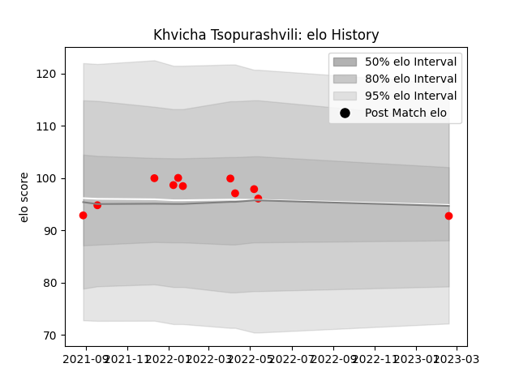

---  
layout: page  
title: Khvicha Tsopurashvili  
date: 2023-02-24 02:22:47.240052  
categories: player  
---
# Khvicha Tsopurashvili

## Positions: P

## Current elo: 93.0

## Current Percentile: None

# Elo History

# Match History

| Team   |   Appearances |   Win Rate |
|:-------|--------------:|-----------:|
| Rouen  |            11 |   0.181818 |

| Opponent           |   Matches |   Win Rate |
|:-------------------|----------:|-----------:|
| Beziers            |         2 |        0.5 |
| Carcassonne        |         2 |        0   |
| Colomiers          |         2 |        0   |
| Agen               |         1 |        0   |
| Bayonne            |         1 |        0   |
| Biarritz Olympique |         1 |        0   |
| US Bressane        |         1 |        0   |
| Vannes             |         1 |        1   |