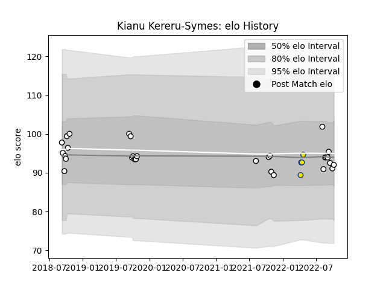

---  
layout: page  
title: Kianu Kereru-Symes  
date: 2023-03-16 11:31:49.725478  
categories: player  
---
# Kianu Kereru-Symes

## Positions: H

## Current elo: 92.0

## Current Percentile: 49.0

# Elo History

# Match History

| Team        |   Appearances |   Win Rate |
|:------------|--------------:|-----------:|
| Hawke's Bay |            29 |   0.534483 |
| Hurricanes  |             4 |   0.75     |

| Opponent         |   Matches |   Win Rate |
|:-----------------|----------:|-----------:|
| Tasman           |         4 |   0.25     |
| Waikato          |         4 |   0.625    |
| Bay of Plenty    |         3 |   0.333333 |
| Canterbury       |         3 |   0.333333 |
| Manawatu         |         3 |   1        |
| Counties Manukau |         2 |   1        |
| North Harbour    |         2 |   0.5      |
| Otago            |         2 |   0.5      |
| Taranaki         |         2 |   0.5      |
| Wellington       |         2 |   0        |
| Crusaders        |         1 |   0        |
| Highlanders      |         1 |   1        |
| Moana Pasifika   |         1 |   1        |
| Northland        |         1 |   1        |
| Queensland Reds  |         1 |   1        |
| Southland        |         1 |   1        |