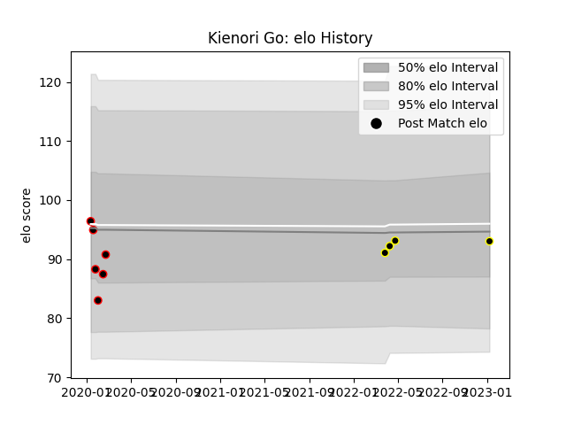

---  
layout: page  
title: Kienori Go  
date: 2023-02-02 19:03:19.905344  
categories: player  
---
# Kienori Go

## Positions: H

## Current elo: 96.0

## Current Percentile: None

# Elo History

# Match History

| Team             |   Appearances |   Win Rate |
|:-----------------|--------------:|-----------:|
| Tokyo Sungoliath |             7 |   1        |
| Mie Honda Heat   |             6 |   0.333333 |

| Opponent                          |   Matches |   Win Rate |
|:----------------------------------|----------:|-----------:|
| Yokohama Canon Eagles             |         3 |          1 |
| Black Rams Tokyo                  |         2 |          1 |
| Hanazono Kintetsu Liners          |         1 |          1 |
| Kobelco Kobe Steelers             |         1 |          1 |
| Kubota Spears Funabashi Tokyo-Bay |         1 |          0 |
| Mitsubishi Dynaboars              |         1 |          1 |
| NTT Docomo Red Hurricanes Osaka   |         1 |          1 |
| Toshiba Brave Lupus Tokyo         |         1 |          0 |
| Toyota Verblitz                   |         1 |          0 |
| Urayasu D-Rocks                   |         1 |          0 |