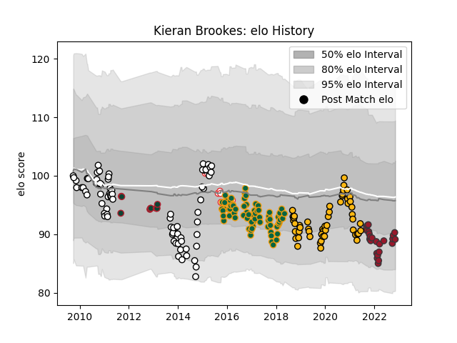

---  
layout: page  
title: Kieran Brookes  
date: 2023-01-06 00:26:45.121593  
categories: player  
---
# Kieran Brookes

## Positions: P

## Country: England

## Current elo: 87.0

## Current Percentile: 4.0

# Elo History

# Match History

| Team               |   Appearances |   Win Rate |
|:-------------------|--------------:|-----------:|
| Newcastle Falcons  |            80 |   0.3      |
| Northampton Saints |            71 |   0.485915 |
| Wasps              |            52 |   0.471154 |
| Toulon             |            28 |   0.517857 |
| England            |            17 |   0.647059 |
| Leicester Tigers   |            10 |   0.4      |

| Opponent             |   Matches |   Win Rate |
|:---------------------|----------:|-----------:|
| Harlequins           |        21 |  0.5       |
| Bath Rugby           |        19 |  0.394737  |
| Saracens             |        18 |  0.0555556 |
| Exeter Chiefs        |        17 |  0.352941  |
| Leicester Tigers     |        15 |  0.2       |
| Sale Sharks          |        15 |  0.5       |
| Gloucester Rugby     |        14 |  0.428571  |
| Wasps                |        14 |  0.107143  |
| London Irish         |        12 |  0.708333  |
| Worcester Warriors   |        10 |  0.7       |
| Northampton Saints   |         9 |  0.111111  |
| Newcastle Falcons    |         8 |  0.375     |
| Montpellier Herault  |         6 |  0.25      |
| Bristol Rugby        |         6 |  1         |
| Brive                |         5 |  0.4       |
| London Welsh         |         3 |  1         |
| Wales                |         3 |  0.666667  |
| New Zealand          |         3 |  0         |
| Bucuresti            |         3 |  1         |
| France               |         3 |  1         |
| Stade Francais Paris |         3 |  0.666667  |
| Stade Toulousain     |         3 |  0         |
| Racing 92            |         3 |  0.166667  |
| Clermont Auvergne    |         3 |  0.333333  |
| Castres Olympique    |         3 |  0         |
| Yorkshire Carnegie   |         2 |  0.5       |
| Perpignan            |         2 |  0.5       |
| Lyon                 |         2 |  1         |
| Pau                  |         2 |  1         |
| Leeds                |         2 |  0.5       |
| Leinster             |         2 |  0         |
| Australia            |         2 |  0.5       |
| La Rochelle          |         2 |  0.5       |
| Biarritz Olympique   |         2 |  1         |
| Bordeaux Begles      |         2 |  0.5       |
| Dragons              |         2 |  0.5       |
| Scarlets             |         2 |  1         |
| Scotland             |         1 |  1         |
| Samoa                |         1 |  1         |
| South Africa         |         1 |  0         |
| Agen                 |         1 |  1         |
| Ospreys              |         1 |  1         |
| Italy                |         1 |  1         |
| Ireland              |         1 |  1         |
| Glasgow Warriors     |         1 |  1         |
| Fiji                 |         1 |  1         |
| Edinburgh            |         1 |  0         |
| Cardiff Blues        |         1 |  0         |
| Calvisano            |         1 |  1         |
| Bourgoin-Jallieu     |         1 |  1         |
| Bayonne              |         1 |  0         |
| Zebre                |         1 |  1         |