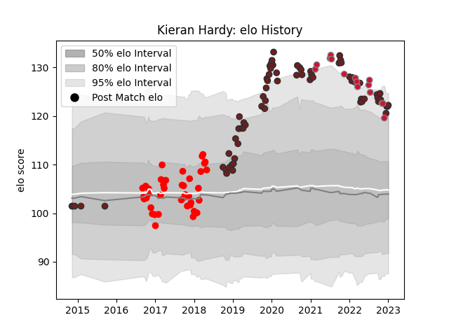

---  
layout: page  
title: Kieran Hardy  
date: 2022-11-15 23:36:53.335798  
categories: player  
---
# Kieran Hardy

## Positions: SH

## Country: Wales

## Current elo: 109.0

## Current Percentile: 88.0

# Elo History

# Match History

| Team     |   Appearances |   Win Rate |
|:---------|--------------:|-----------:|
| Scarlets |            64 |   0.476562 |
| Jersey   |            28 |   0.571429 |
| Wales    |            14 |   0.464286 |

| Opponent            |   Matches |   Win Rate |
|:--------------------|----------:|-----------:|
| Cardiff Blues       |         8 |   0.375    |
| Dragons             |         7 |   0.571429 |
| Ospreys             |         6 |   0.583333 |
| Edinburgh           |         5 |   0        |
| Ulster              |         4 |   0.5      |
| Connacht            |         4 |   0.25     |
| London Scottish     |         4 |   0.75     |
| Argentina           |         3 |   0.5      |
| London Irish        |         3 |   1        |
| Yorkshire Carnegie  |         3 |   0.333333 |
| Toulon              |         3 |   0        |
| Southern Kings      |         3 |   1        |
| South Africa        |         3 |   0.333333 |
| Rotherham Titans    |         3 |   0.666667 |
| Munster             |         3 |   0.333333 |
| Zebre               |         3 |   1        |
| Bedford             |         3 |   0.666667 |
| Doncaster           |         3 |   0.333333 |
| Benetton Treviso    |         3 |   0.333333 |
| England             |         2 |   0.5      |
| Ealing Trailfinders |         2 |   0        |
| Richmond            |         2 |   0.5      |
| Cheetahs            |         2 |   1        |
| Glasgow Warriors    |         2 |   0        |
| Cornish Pirates     |         2 |   1        |
| Bristol Rugby       |         2 |   0.5      |
| Leinster            |         2 |   0        |
| Bayonne             |         2 |   1        |
| Hartpury College    |         2 |   1        |
| Stormers            |         1 |   0        |
| Scotland            |         1 |   1        |
| Canada              |         1 |   1        |
| France              |         1 |   0        |
| Northampton Saints  |         1 |   0        |
| Nottingham          |         1 |   1        |
| New Zealand         |         1 |   0        |
| London Welsh        |         1 |   0        |
| Fiji                |         1 |   1        |
| Lions               |         1 |   1        |
| Italy               |         1 |   0        |
| Leicester Tigers    |         1 |   1        |